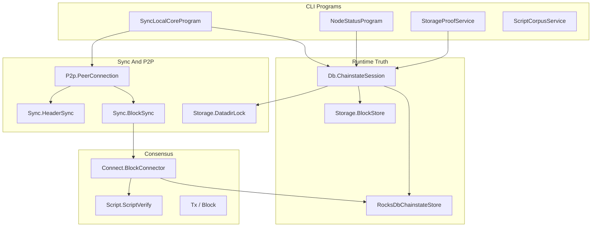

# csbitnode Architecture

This document maps the C# implementation: assembly layout, major data flows, and
the invariants that keep P2P, validation, chainstate, and proof surfaces in
one shape. For commands, use [README.md](../README.md). For live
mission-control posture, query Project reports instead of reading this file as
status.

Shared contracts own the cross-port rules:

- [Code documentation philosophy](../../Shared/CODE_DOCUMENTATION.md)
- [Validation pipeline](../../Shared/consensus/VALIDATION_PIPELINE.md)
- [Chainstate store](../../Shared/chainstate/CHAINSTATE_STORE.md)
- [Status contract](../../Shared/STATUS_CONTRACT.md)
- [Docker runtime contract](../../Shared/docker/DOCKER_RUNTIME_CONTRACT.md)
- [Consensus runway](../../Shared/consensus/CONSENSUS_RUNWAY.md)

## Assembly Layers

C# organizes orchestration, wire parsing, consensus, and RocksDB storage under
`src/CsBitNode/`. CLI programs in `Program.cs` dispatch to service-style entry
points.



| Layer | Namespace / path | Responsibility |
|-------|------------------|----------------|
| Chain | `Chain`, `Config` | testnet4 parameters, paths, runtime env. |
| Wire / messages | `Wire`, `Messages` | P2P framing and payload codecs. |
| P2P | `P2p` | Outbound peer connection, header/block requests. |
| Sync | `Sync` | Header download, block sync orchestration, timing. |
| Consensus | `Consensus.*` | Block connect, script interpreter, sighash, merkle. |
| Runtime state | `Db`, `Storage` | RocksDB chainstate, block files, datadir lock. |
| CLI / proof | `Cli` | Operator commands, corpus, storage proof, diagnostics. |

## Entrypoints

`SyncLocalCoreProgram` opens a `ChainstateSession`, connects through
`PeerConnection`, runs header sync unless skipped, then drives block download
and connect.

`NodeStatusProgram` reads active RocksDB-backed state and prints operator JSON.
It exposes runtime truth; Project may import that truth as a Project projection.

`StorageProofService` and `ScriptCorpusService` are bounded proof surfaces.
They emit evidence; they do not read Project for validation decisions.

## P2P Handshake

`PeerConnection` uses the workspace simple path during initial sync: `version`,
`verack`, `sendheaders`, then header or block requests. That is deferred
advanced negotiation: relay-oriented messages such as `feefilter`, `mempool`,
and compact-block negotiation wait until headers are current and runtime mode
allows honest serving.

The local `version.start_height` must be an honest start_height from validated
runtime truth, not the header tip.

## Header Sync

`HeaderSync` builds locators, requests `headers`, validates each header, and
persists through the chainstate store. Header height and validated height remain
separate fields.

## Block Connect

`BlockConnector.Connect` is the validation and UTXO mutation boundary:

1. Confirms sequential height on validated tip.
2. Structurally validates the block payload.
3. Builds same-block output visibility for in-block spends.
4. Verifies scripts through `ScriptVerify` (optional parallel runner).
5. Performs an atomic chainstate commit through `IChainstateStore`.

A `ValidationBlocker` is the correct failure mode when a spend needs a missing
consensus rule. Do not connect the block by assuming success.

## Script Verification And Sighash

`ScriptVerify`, `Interpreter`, and sighash helpers (`Sighash`, `TaprootSighash`)
implement spend-path verification. Stay aligned with Shared corpus fixtures and
[`Docs/script-semantics-gotchas.md`](../../../Docs/script-semantics-gotchas.md).

## Chainstate And Runtime Truth

`ChainstateSession.OpenNative` is the primary opening path. It acquires the
single-writer datadir lock (unless read-only/no-op), marks native storage, opens
`RocksDbChainstateStore`, and opens block storage.

| Surface | Runtime owner |
|---------|---------------|
| Headers, sync status, validated tip, UTXO, undo | `RocksDbChainstateStore` |
| Raw block bytes | `Storage.BlockStore` |
| Mutual exclusion | `Storage.DatadirLock` (`.csbitnode.lock`) |

Status and sync read these runtime surfaces. Project reports are mission-control
projections; node code must not depend on Project state.

## Single-Writer Datadir Lock

`DatadirLock.Acquire` implements the single-writer datadir lock for
sync/connect/rebuild. Overlapping writers can corrupt UTXO state and create
false validation blockers.

## Status, Export, And Proof Surfaces

Status and proof CLIs read or establish runtime truth from the active datadir.
Proof JSON belongs under `Nodes/Shared/conformance/results/` for Project import.

Do not restate latest pass/fail posture in architecture prose.

## Docker And Local Reference Proof

Follow `Nodes/Shared/docker/ports/csharp.docker.json` and the Shared Docker
runtime contract. Fresh proof volumes are comparability harnesses; supervisor
volumes support operational debugging.

## C#-Specific Design Choices

- **Managed runtime with native RocksDB** — `RocksDbChainstateStore` binds
  operational truth; optional file backend exists for tests only.
- **Static `BlockConnector`** — connect orchestration centralized with explicit
  same-block output maps.
- **Parallel script runner flag** — optional input parallelism within connect
  while preserving block transaction order.
- **Service-style CLI** — `Program.cs` dispatches to focused service classes.

## Mission-Control Queries

```bash
python3 Project/scripts/report.py --db Project/project.db --section port-status
python3 Project/scripts/report.py --db Project/project.db --section consensus-runway
python3 Project/scripts/report.py --db Project/project.db --section baseline-5k
python3 Project/scripts/preflight_port_baseline.py --db Project/project.db --port csharp --strict
python3 Project/scripts/preflight_consensus_runway.py --db Project/project.db --port csharp --stage corpus --strict
```
