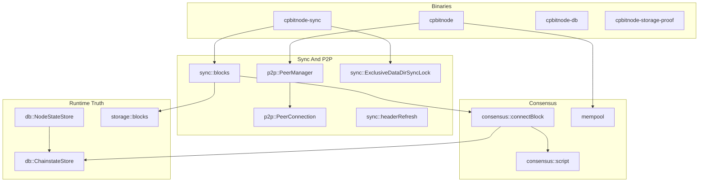

# cpbitnode Architecture

This document maps the C++ implementation: module roles, major data flows, and
the invariants that keep P2P, validation, chainstate, mempool, and proof
surfaces in one shape. For commands, use [README.md](../README.md). For live
mission-control posture, query Project reports instead of reading this file as
status.

Shared contracts own the cross-port rules:

- [Code documentation philosophy](../../Shared/CODE_DOCUMENTATION.md)
- [Validation pipeline](../../Shared/consensus/VALIDATION_PIPELINE.md)
- [Chainstate store](../../Shared/chainstate/CHAINSTATE_STORE.md)
- [Status contract](../../Shared/STATUS_CONTRACT.md)
- [Docker runtime contract](../../Shared/docker/DOCKER_RUNTIME_CONTRACT.md)
- [Consensus runway](../../Shared/consensus/CONSENSUS_RUNWAY.md)

## Module Layers

C++ organizes wire parsing, sync, consensus, mempool, and RocksDB storage under
`include/cpbitnode/`. Binaries are thin CLI wrappers around library surfaces.



| Layer | C++ namespace / path | Responsibility |
|-------|----------------------|----------------|
| Chain | `chain`, `config` | testnet4 parameters, settings, runtime env. |
| Wire / messages | `wire`, `messages` | P2P framing and payload codecs. |
| P2P | `p2p` | Peer connections, manager, transport, discovery, inbound server. |
| Sync | `sync` | Header refresh, block download, validation hooks, datadir lock. |
| Consensus | `consensus` | Block connect, script interpreter, sighash, merkle, witness. |
| Mempool | `mempool` | Admission, orphan handling, relay helpers. |
| Storage | `db`, `storage` | RocksDB operational + chainstate stores, block files. |
| CLI / proof | binaries, `conformance` | Operator tools, corpus harness, Docker proof entrypoints. |

Cpp is **RocksDB-only** for runtime truth: headers, block index, sync state,
validated tip, UTXO, undo, metadata, blocker state, and status fields.

## Entrypoints

| Binary | Role |
|--------|------|
| `cpbitnode` | Long-running node (`runNode`): P2P manager, deferred handshake completion in LISTEN paths, mempool and metrics HTTP when enabled. |
| `cpbitnode-sync` | Batch sync: headers and blocks through sync modules with exclusive datadir lock. |
| `cpbitnode-db` | Status/export JSON from active RocksDB state. |
| `cpbitnode-storage-proof` | Bounded storage/backend proof surface. |
| `cpbitnode-healthcheck` | JSON health probe. |
| `cpbitnode-blocker-inspect` | Blocker diagnostics from stored metadata. |

Proof and status binaries read runtime truth; Project imports their output as
Project projections later.

## P2P Handshake

`p2p::PeerConnection` owns outbound and inbound testnet4 sockets. During
initial sync the workspace simple path applies: `version`, `verack`,
`sendheaders`, then header or block work. That is deferred advanced
negotiation: relay-oriented messages such as `feefilter`, `mempool`, and
compact-block negotiation wait until the node has the runtime mode and validated
state required to make them honest.

`completeDeferredHandshake()` promotes advanced negotiation only after the
caller establishes headers-current or live LISTEN preconditions. Batch sync
paths keep relay negotiation deferred while focusing on validated block catch-up.

The local `version.start_height` must be an honest start_height from validated
runtime truth, not the header tip. Inflated claims can make peers disconnect as
"too advanced."

## Header Sync

`sync::headerRefresh` and related header modules build locators, request
`headers`, validate linkage and PoW, and persist header state in RocksDB.
Header height and validated height remain separate so status and handshake
claims stay honest.

## Block Acquisition And Connect

`sync::blocks` orchestrates block download and ordered connect. `consensus::connectBlock`
is the validation boundary:

1. Confirms sequential height on validated tip.
2. Parses and structurally validates the block.
3. Uses a block-local UTXO view for same-block churn.
4. Loads external prevouts from RocksDB.
5. Verifies scripts through `script::ScriptVerifyRunner`.
6. Captures undo for persisted spends.
7. Performs an atomic chainstate commit.

Store block bytes only after validation succeeds so block index, undo, UTXO, and
validated tip remain one runtime truth.

A validation blocker is the correct stop when a missing rule appears. Do not
connect the block by assuming success.

## Script Verification And Sighash

`consensus::script` provides interpreter, template dispatch, and sighash
builders. Regression tests and Shared corpus artifacts prove behavior offline
before long-sync dependence.

Link script traps to
[`Docs/script-semantics-gotchas.md`](../../../Docs/script-semantics-gotchas.md)
rather than duplicating them inline.

## Chainstate And Runtime Truth

`db::NodeStateStore` mirrors operational observations (sync status, events,
wire capabilities). `db::ChainstateStore` owns UTXO, undo, chainstate metadata,
and validated tip. Both read/write through RocksDB in native mode.

Project mission-control DB is never consulted during connect or validation.

## Single-Writer Datadir Lock

`sync::ExclusiveDataDirSyncLock` implements the single-writer datadir lock for
sync/connect/rebuild. It protects runtime truth: overlapping writers can lose
UTXO or undo mutations and create false validation blockers.

Sync entrypoints acquire the lock for the duration of mutable work.

## Mempool And Serving

`mempool` modules support admission, orphan handling, and relay surfaces used
when the live node completes deferred handshake and enters serving-oriented
modes. Mempool validation still consumes the same chainstate runtime truth as
block connect.

## Status, Export, And Proof Surfaces

`cpbitnode-db` and health/blocker tools read active RocksDB state. Docker proof
targets emit compact JSON under `Nodes/Shared/conformance/results/`.

Do not embed latest pass/fail claims in architecture prose; query Project.

## Docker And Local Reference Proof

Follow `Nodes/Shared/docker/ports/cpp.docker.json` and the Shared Docker runtime
contract. Fresh proof volumes are comparability harnesses; supervisor volumes
support operational debugging — do not confuse the two modes.

## C++-Specific Design Choices

- **Header/implementation split** — public contracts and footgun comments in
  headers; hot-path ordering comments in `.cpp` translation units.
- **Virtual peer transport** — test injection via transport factories.
- **RocksDB-only gate** — configure rejects non-RocksDB operational backends.
- **Full node surface** — unlike Go/Rust comparator-first milestones, C++ ships
  live `cpbitnode` with mempool and metrics HTTP alongside batch sync.

## Mission-Control Queries

```bash
python3 Project/scripts/report.py --db Project/project.db --section port-status
python3 Project/scripts/report.py --db Project/project.db --section consensus-runway
python3 Project/scripts/report.py --db Project/project.db --section baseline-5k
python3 Project/scripts/preflight_port_baseline.py --db Project/project.db --port cpp --strict
python3 Project/scripts/preflight_consensus_runway.py --db Project/project.db --port cpp --stage corpus --strict
```

See also [`STATUS.md`](STATUS.md) for Project query pointers (not live status tables).
