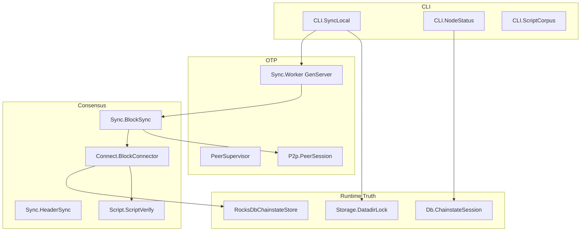

# exbitnode Architecture

This document maps the Elixir supervised follower: OTP boundaries, sync paths,
and the invariants that keep P2P, validation, and RocksDB runtime truth aligned.
For commands, use [README.md](../README.md). For live mission-control posture,
query Project reports instead of reading this file as status.

Shared contracts own the cross-port rules:

- [Code documentation philosophy](../../Shared/CODE_DOCUMENTATION.md)
- [Validation pipeline](../../Shared/consensus/VALIDATION_PIPELINE.md)
- [Chainstate store](../../Shared/chainstate/CHAINSTATE_STORE.md)
- [Status contract](../../Shared/STATUS_CONTRACT.md)
- [Docker runtime contract](../../Shared/docker/DOCKER_RUNTIME_CONTRACT.md)
- [Consensus runway](../../Shared/consensus/CONSENSUS_RUNWAY.md)

## Current Milestone (Honest Scope)

Elixir is a baseline-retired supervised follower with live sync toward known
consensus blockers:

- OTP `PeerSupervisor` / `Sync.Worker` for isolated sync tasks
- RocksDB native chainstate (`Exbitnode.Db.RocksDbChainstateStore`)
- deferred advanced negotiation on outbound handshake (`sendheaders` only)
- block connect with validation blockers for unsupported script templates
- Docker local-reference proof lanes (5k / 10k / 50k)

It does **not** claim binary-gate tip maintenance. Query Project for imported
runway posture instead of README milestone notes.

## Module Layout



| Module | Responsibility |
|--------|----------------|
| `P2p.PeerSession` | TCP wire client, handshake, header/block requests. |
| `Sync.HeaderSync` / `Sync.BlockSync` | Header download and block fetch orchestration. |
| `Consensus.Connect.BlockConnector` | Block connect, UTXO view, validation blockers. |
| `Consensus.Script.*` | Interpreter, sighash, template dispatch. |
| `Db.RocksDbChainstateStore` | RocksDB runtime truth for headers, UTXO, undo, blockers. |
| `Storage.DatadirLock` | Single-writer datadir lock (`.exbitnode.lock`). |
| `Sync.Worker` | Serializes `sync-local` through one GenServer call path. |

## P2P Handshake

`PeerSession.handshake_as_initiator/1` uses the workspace simple path:
`version` → `verack` → `sendheaders`. That is deferred advanced negotiation
during catch-up — no `feefilter`, `mempool`, or compact-block negotiation here.

`start_height` on the version payload must reflect honest validated runtime
truth from `ChainstateTracker`, not the header tip on empty state.

## Block Connect

`BlockConnector.connect/7` is the validation and UTXO mutation boundary. Missing
script rules raise `ValidationBlocker` or `UnsupportedScriptRule`; do not connect
by assuming success.

## Single-Writer Datadir Lock

`SyncLocal.run/1` acquires `DatadirLock` before opening native chainstate.
Overlapping sync processes against one datadir can corrupt UTXO state.

## Status And Proof Surfaces

`CLI.NodeStatus` reads runtime truth. Proof JSON belongs under
`Nodes/Shared/conformance/results/` for Project import.

## Mission-Control Queries

```bash
python3 Project/scripts/report.py --db Project/project.db --section port-status
python3 Project/scripts/report.py --db Project/project.db --section consensus-runway
python3 Project/scripts/report.py --db Project/project.db --section baseline-5k
```

Blocker facts and resume guidance: [docs/BLOCKER_LEDGER.md](BLOCKER_LEDGER.md).
