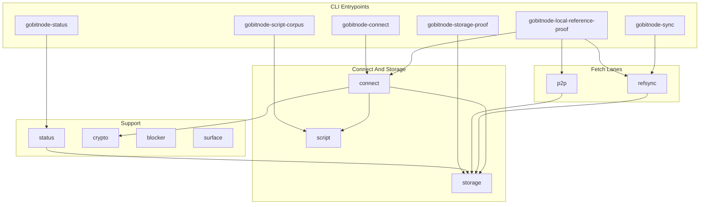

# gobitnode Architecture

This document maps the Go implementation: package roles, major data flows, and
the invariants that keep storage, connect, proof, and comparator surfaces in
one shape. For commands, use [README.md](../README.md). For live
mission-control posture, query Project reports instead of reading this file as
status.

Shared contracts own the cross-port rules:

- [Code documentation philosophy](../../Shared/CODE_DOCUMENTATION.md)
- [Validation pipeline](../../Shared/consensus/VALIDATION_PIPELINE.md)
- [Chainstate store](../../Shared/chainstate/CHAINSTATE_STORE.md)
- [Status contract](../../Shared/STATUS_CONTRACT.md)
- [Docker runtime contract](../../Shared/docker/DOCKER_RUNTIME_CONTRACT.md)
- [Consensus runway](../../Shared/consensus/CONSENSUS_RUNWAY.md)

## Package Layers

Go organizes proof, connect, and comparator code under `internal/` with thin
`cmd/` entrypoints. There is no long-running live node service yet; runtime
work flows through storage open, connect replay, local Reference fetch, or
bounded P2P fetch.



| Layer | Go package / path | Responsibility |
|-------|-------------------|----------------|
| CLI | `cmd/gobitnode-*` | Operator and proof entrypoints; JSON summaries and exit codes. |
| Local Reference fetch | `internal/refsync` | Core RPC block/hash fetch, structural decode, store raw blocks + header metadata. |
| P2P comparator | `internal/p2p` | Minimal testnet4 client: handshake, `getheaders`, witness `getdata` for proof/comparator lanes. |
| Block connect | `internal/connect` | Replay stored blocks with script verification, block-local UTXO view, atomic RocksDB commit. |
| Script | `internal/script`, `internal/scriptcorpus` | Spend-path verification, sighash precompute, Shared corpus harness. |
| Storage | `internal/storage` | RocksDB runtime truth: metadata, UTXO, undo, block index, raw block files. |
| Status | `internal/status` | Operator JSON from active datadir metadata and lock observation. |
| Crypto | `internal/crypto` | Native libsecp256k1 reporting and verification backend selection. |
| Surface | `internal/surface` | Runtime surface labels for proof JSON (`host` vs `docker`). |

## Entrypoints

`gobitnode-sync` (`cmd/gobitnode-sync`) fetches raw blocks through local
Reference Core RPC via `refsync.Run` and stores them in the Go RocksDB datadir.
It advances stored block height and header metadata; it does not run the full
connect pipeline by itself.

`gobitnode-connect` (`cmd/gobitnode-connect`) replays blocks already on disk
through `connect.Run`, performing independent script verification and UTXO
mutation up to a target height.

`gobitnode-local-reference-proof` orchestrates the optimized proof pipeline:
prefetch (RPC or P2P byte source), store, then connect with timing evidence in
the result JSON. Modes include `pipeline` and `staged`; byte source may be
`rpc` or `p2p` for comparator work.

`gobitnode-status` and `gobitnode-storage-proof` are read/write proof surfaces
over the same RocksDB datadir. They expose or establish runtime truth; Project
may import the output later as a Project projection.

`gobitnode-script-corpus` runs the Shared 45-fixture script corpus offline.

## P2P Handshake

`internal/p2p` implements a minimal outbound client for comparator and proof
lanes, not a full peer manager. The handshake path is intentionally simple:
`version`, `verack`, then `sendheaders`. That matches workspace deferred
advanced negotiation: the Go comparator does not send relay-oriented messages
such as `feefilter`, `mempool`, or compact-block negotiation on this path.

The local `version` payload advertises `start_height = 0` in
`versionPayload()`. For comparator fetches from genesis or a fresh proof
volume, that is an honest start_height relative to validated runtime truth.
Do not inflate it to header tip when connect lag exists.

This P2P surface is evidence-oriented. It is not yet the long-running sync
backbone required for tip maintenance or the binary end gate.

## Header And Block Acquisition

**RPC lane (`refsync`)** — sequential Core RPC `getblockhash` / `getblock` per
height, structural validation through `refsync.DecodeBlock`, then
`storage.Store` persistence of raw bytes and block-index metadata.

**P2P lane (`p2p.FetchBlocks`)** — after handshake, builds a header chain with
`getheaders`, then batches witness block `getdata` requests with configurable
prefetch. Used by local-reference proof when `--byte-source=p2p` and by Docker
`docker-proof-local`.

Stored block height and validated height are separate fields in storage
metadata. Fetch lanes may advance stored coverage without advancing the
validation gate until `connect` succeeds.

## Block Connect

`internal/connect` is Go's validation and UTXO mutation boundary. For each
stored block height it:

1. Reads raw block bytes from the block store.
2. Parses and structurally validates header linkage and merkle shape.
3. Builds a block-local UTXO view (`blockView`) for same-block creates and
   spends.
4. Batch-loads external prevouts from RocksDB where needed.
5. Verifies scripts through `ScriptVerifyRunner` (parallel input verification
   when configured).
6. Captures undo for external persisted spends.
7. Performs an atomic chainstate commit through `storage.Store.CommitBlockWithTiming`.

The block-local UTXO view resolves same-block churn before durable UTXO
mutation. Same-block created outputs must be visible to later transactions in
the block without being committed until the whole block succeeds.

A validation blocker is the right failure mode when connect cannot proceed
(missing UTXO, unsupported script template, script failure). Blocker records
land in storage metadata with height, transaction, input, and failure detail
for Shared follow-up. Connect must not silently succeed past a missing rule.

## Script Verification

`internal/script` implements spend-path verification and sighash precompute used
by connect. `internal/scriptcorpus` wires the Shared script fixture harness.

Script verification must stay aligned with Shared corpus fixtures and
[`Docs/script-semantics-gotchas.md`](../../../Docs/script-semantics-gotchas.md).
Wallet-friendly transaction serialization is not a safe stand-in for consensus
sighash bytes.

## Chainstate And Runtime Truth

`storage.Open` is the primary runtime truth boundary. It:

- Writes `.gobitnode_native_storage` marker metadata.
- Opens RocksDB under `<datadir>/chainstate-rocksdb/`.
- Owns block files under `<datadir>/blocks/`.
- Stores chainstate metadata, UTXO rows, undo, and validated tip fields.

Status and connect read this store directly. Project reports are
mission-control projections from imported artifacts; sync and connect code must
not read Project state.

| Surface | Runtime owner |
|---------|---------------|
| Metadata, sync status, blocker, validated tip | RocksDB via `storage.Store` |
| UTXO set and undo | RocksDB UTXO keyspace (codec v2) |
| Raw block bytes | `<datadir>/blocks/` |
| Writer lock observation | `.gobitnode.lock` (status only today) |

## Single-Writer Datadir Lock

Go records lock posture in status via `.gobitnode.lock` under the datadir
(`internal/status.lockInfo`). Treat overlapping connect or storage writers on
one datadir as a chainstate integrity risk: dual writers can corrupt UTXO
state and produce false validation blockers.

Proof and connect entrypoints should not assume they can safely overlap on the
same datadir without an explicit single-writer discipline. Prefer isolated
proof volumes for Docker fresh proofs.

## Status, Export, And Proof Surfaces

`status.Build` emits operator JSON: header height, stored block height,
validated height, backend identity, native crypto backend, lock status, and
current blocker when present.

Proof entrypoints write bounded JSON under
`Nodes/Shared/conformance/results/`. They emit evidence for Project import;
they do not decide validation authority from Project state.

Markdown docs and README commands may name these surfaces. They should not
restate latest pass/fail posture — query Project instead.

## Docker And Local Reference Proof

Go Docker paths follow the Shared Docker runtime contract and
`Nodes/Shared/docker/ports/go.docker.json`.

| Target | Role |
|--------|------|
| `docker-proof-local` | Fresh-volume local Reference **P2P** comparator for official 5k supporting evidence. |
| `docker-proof-rpc-replay` | Local Reference **RPC** replay lane; explicit replay evidence, not the P2P comparator. |
| `docker-storage-proof`, `docker-script-corpus`, `docker-smoke-once` | Bounded backend and corpus surfaces. |

Fresh proof targets recreate Docker volumes. Do not treat comparator harness
success as binary-gate completion or live tip maintenance.

## Go-Specific Design Choices

- **CGO RocksDB** — native storage through `rocksdb` C bindings; tuning and WAL
  posture are part of proof metadata.
- **Split fetch and connect** — `refsync` / `p2p` store bytes; `connect` owns
  validation and UTXO advance. Local-reference proof can pipeline both.
- **Explicit `blockView`** — same-block UTXO semantics live in Go structs
  rather than a generic store API.
- **Script runner pool** — reused worker threads with optional parallel input
  verify inside a block.
- **Comparator-first P2P** — minimal client sufficient for headers/blocks fetch,
  not deferred-handshake completion on a live serving node.

These are Go choices for the same Bitcoin pipeline described in Shared docs.
Java and TypeScript currently document fuller live sync surfaces; Go documents
the native storage + connect + comparator path honestly.

## Mission-Control Queries

Run these from the repository root when you need imported Go posture:

```bash
python3 Project/scripts/report.py --db Project/project.db --section port-status
python3 Project/scripts/report.py --db Project/project.db --section consensus-runway
python3 Project/scripts/report.py --db Project/project.db --section baseline-5k
python3 Project/scripts/preflight_port_baseline.py --db Project/project.db --port go --strict
python3 Project/scripts/preflight_consensus_runway.py --db Project/project.db --port go --stage corpus --strict
```
