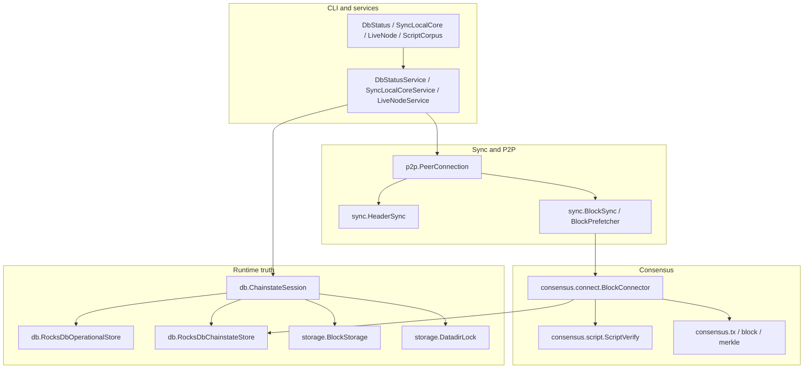

# jbitnode Architecture

This document maps the Java implementation: package roles, major data flows,
and the invariants that keep P2P, validation, chainstate, and proof surfaces in
one shape. For commands, use [README.md](../README.md). For live mission-control
posture, query Project reports instead of reading this file as status.

Shared contracts own the cross-port rules:

- [Code documentation philosophy](../../Shared/CODE_DOCUMENTATION.md)
- [Validation pipeline](../../Shared/consensus/VALIDATION_PIPELINE.md)
- [Chainstate store](../../Shared/chainstate/CHAINSTATE_STORE.md)
- [Status contract](../../Shared/STATUS_CONTRACT.md)
- [Docker runtime contract](../../Shared/docker/DOCKER_RUNTIME_CONTRACT.md)
- [Consensus runway](../../Shared/consensus/CONSENSUS_RUNWAY.md)

## Package Layers

Java keeps orchestration, wire parsing, consensus, and storage in separate
packages. CLI entrypoints are thin shims; service classes own runtime wiring.



| Layer | Java package | Responsibility |
|-------|--------------|----------------|
| Chain identity | `com.jbitnode.chain`, `config` | testnet4 parameters, runtime env selection, script verification settings. |
| Wire | `wire`, `messages` | Bitcoin P2P framing and payload parse/serialize code without socket ownership. |
| P2P | `p2p` | Outbound peer connection, simple handshake, header and block request surfaces. |
| Sync | `sync` | Header validation, block acquisition, block prefetch, block connection orchestration. |
| Consensus | `consensus.*`, `scripts` | Block shape, merkle/witness checks, UTXO connect rules, script templates, sighash, secp256k1. |
| Runtime state | `db`, `storage` | RocksDB operational state, RocksDB UTXO/undo metadata, block files, single-writer datadir lock. |
| CLI and proof | `cli`, Make/Docker targets | Operator commands, status export, corpus proof, storage replay, Docker proof entrypoints. |

## Entrypoints

`SyncLocalCore` is the normal local-Core sync entrypoint. It opens a
`ChainstateSession`, connects to the configured peer through `PeerConnection`,
runs header sync unless told to skip it, then drives block download and connect.

`LiveNode` is the long-running node service surface. It shares the same P2P and
chainstate primitives, but live serving and relay behavior must respect the
Shared status and P2P contracts before advancing beyond initial sync behavior.

`DbStatus` and `ChainstateStatus` read the active RocksDB-backed state and print
operator JSON. They expose runtime truth; Project may later import that truth as
a Project projection, but node code must not depend on Project state.

`ScriptCorpus`, `ChainstateBackendReplay`, and Docker proof targets are proof
surfaces. They are meant to emit bounded evidence, not to become alternate
runtime stores.

## P2P Handshake

`PeerConnection` owns the outbound testnet4 socket and message stream. During
initial sync it uses the workspace simple path: `version`, `verack`,
`sendheaders`, then header or block requests. That is deliberate deferred
advanced negotiation: relay-oriented messages such as `feefilter`, `mempool`,
and compact-block negotiation wait until the node has the runtime mode and
validated state required to make them honest.

The local `version.start_height` is an honest start_height. It comes from the
validated tip used by block sync, not from the header tip. Advertising header
progress before independently connected blocks exist can make peers treat the
node as too advanced and disconnect.

The P2P layer records wire capabilities and peer lifecycle events through
`ProjectTracker`, but those records are operational observations. They are not
consensus authority and are not a substitute for connected-block validation.

## Header Sync

`HeaderSync` builds locators from the operational store, requests `headers`, and
validates each returned header with `HeaderValidator`. Header state lives in the
RocksDB operational store so later block sync can ask for missing heights without
repeating the network discovery phase.

Header sync can make the node aware of chainwork and peer tip, but it does not
advance the validation gate. Java keeps header height and validated height
separate so status surfaces can show the difference without inflating P2P
handshake claims.

## Block Acquisition

`BlockSync` asks the tracker for missing block heights, requests block bytes from
the active `BlockSource`, and connects blocks in height order. `BlockPrefetcher`
may overlap network I/O with validation, but the connect path stays ordered:
height `n` connects only on top of validated height `n - 1`.

Wire capability writes are deliberately sparse in the hot path. Once-per-run
capability marks preserve the proof signal without turning each block into an
operational-store write storm.

## Block Connect

`BlockConnector` is Java's validation and UTXO mutation boundary. For each block
it:

1. Confirms the block connects to the validated tip.
2. Parses and structurally validates the block.
3. Builds a block-local UTXO view for spends and creates inside the block.
4. Prefetches external prevouts with batched RocksDB reads.
5. Builds per-input script jobs and verifies them through `ScriptVerifyRunner`.
6. Captures undo for persisted prevouts.
7. Performs an atomic chainstate commit through `ChainstateStore`.

The block-local UTXO view matters because Bitcoin blocks can spend outputs
created earlier in the same block. Those created outputs must be visible during
validation without being durable until the whole block succeeds.

A validation blocker is the right failure mode when a spend needs a consensus
rule Java does not implement. The blocker should preserve enough height,
transaction, input, script template, and missing-rule detail for Shared corpus
or rule-ledger follow-up. It must not silently connect the block.

## UTXO, Undo, And Rebuild

`RocksDbChainstateStore` owns Java's active UTXO keyspace, undo rows, chainstate
metadata, maintained UTXO count, and validated tip. `commitBlockNative` writes
spends, creates, undo, metadata, and tip in one RocksDB batch so the node has
one runtime truth after a successful block.

Undo rows cover external persisted spends. Same-block churn is resolved inside
the block-local UTXO view and does not need durable undo as a separate chain
history fact.

`ChainstateRebuildService` replays stored block bytes through the same connect
machinery. Rebuild is not a second validation algorithm; it is a way to
reconstruct the active chainstate from stored validated material.

## Script Verification And Sighash

`ScriptVerify` is the spend-path dispatcher. It recognizes supported output
templates and routes them to legacy, SegWit v0, P2SH-wrapped witness, Taproot
key-path, or tapscript verification. Unsupported witness versions, unsupported
templates, or missing interpreter rules must stop validation rather than become
implicit success.

Sighash classes are consensus byte-shape code:

- `LegacySighash` implements pre-SegWit signing serialization, including Core's
  `SIGHASH_SINGLE` edge behavior.
- `WitnessSighash` implements BIP143 preimages for SegWit v0 spends.
- `TaprootSighash` implements BIP341 TapSchnorr hashing for key-path and
  tapscript spends.

These classes should stay close to the Shared script fixtures and consensus
runway. Wallet-friendly transaction serialization is not a safe abstraction for
consensus sighash bytes.

## Chainstate And Runtime Truth

`ChainstateSession` is the single opening path for read-write sync, rebuild, and
status. It acquires the single-writer datadir lock, marks native storage, opens
the operational RocksDB store, opens block storage, opens the chainstate store,
and verifies invariants before handing objects to service code.

The Java runtime splits state by role:

| Surface | Runtime owner |
|---------|---------------|
| Header index, sync status, peer and event observations | `RocksDbOperationalStore` through `ProjectTracker` |
| UTXO set, undo, chainstate metadata, validated tip | `RocksDbChainstateStore` |
| Raw block bytes | `BlockStorage` / `BlockStore` |
| Mutual exclusion | `DatadirLock` |

Status commands read these runtime surfaces. Project reports are mission-control
projections from imported observations and artifacts; they are not read by sync
or consensus code.

## Status, Export, And Proof Surfaces

Java status should answer operator questions from active state: header height,
validated height, stored block coverage, blocker details, backend identity, and
chainstate metadata. It should avoid embedding live readiness claims in docs.

Proof surfaces are intentionally bounded:

- Script corpus proof demonstrates Shared script fixture behavior.
- Native crypto and storage replay proofs demonstrate backend selection and
  codec behavior.
- Docker proof targets demonstrate the runtime package in the Shared local
  Reference topology.
- Benchmark proof artifacts are imported by Project before they become
  mission-control evidence.

Markdown docs may name these surfaces and commands. They should not restate
their latest pass/fail posture.

## Docker And Local Reference Proof

Java Docker paths follow the Shared Docker runtime contract. Proof containers
connect to the local Reference Core topology, use the same native storage and
crypto selection expected of the host runtime, and emit artifacts in the Shared
proof shape.

Fresh proof targets may recreate their volumes. Persistent supervisor targets
reuse state for blocker hunting. Do not confuse those two modes: fresh proofs
are comparability surfaces, while the supervisor is an operational debugging
loop.

## Java-Specific Design Choices

Java's implementation leans on explicit service objects and long-lived runtime
resources:

- `ChainstateSession` centralizes store opening so tests, sync, rebuild, and
  status do not invent competing runtime truth paths.
- `DatadirLock` uses a real file lock plus holder metadata; it is a chainstate
  integrity guard, not an advisory note.
- `ScriptVerifyRunner` is reused across a sync batch so worker threads and
  native secp256k1 state stay warm.
- `BlockPrefetcher` can hide network latency while preserving ordered connect.
- RocksDB batch operations and `multiGet` keep UTXO load and atomic commit costs
  visible in shared timing buckets.

These are Java choices for the same Bitcoin pipeline described in Shared docs.
Other ports may express the same concepts with different native idioms.

## Mission-Control Queries

Run these from the repository root when you need imported Java posture:

```bash
python3 Project/scripts/report.py --db Project/project.db --section port-status
python3 Project/scripts/report.py --db Project/project.db --section consensus-runway
python3 Project/scripts/report.py --db Project/project.db --section baseline-5k
python3 Project/scripts/preflight_port_baseline.py --db Project/project.db --port java --strict
python3 Project/scripts/preflight_consensus_runway.py --db Project/project.db --port java --stage corpus --strict
```
