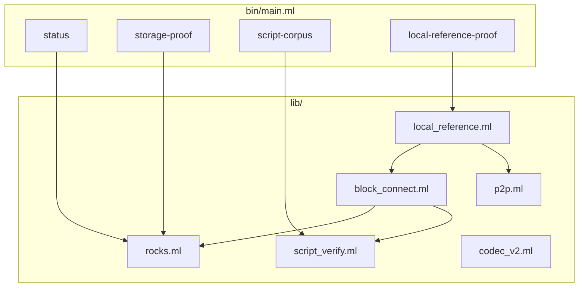

# ocbitnode Architecture

This document maps the OCaml foundation: native bindings, proof commands, bounded
local-reference P2P connect, and the modules that will grow into full sync. For
commands, use [README.md](../README.md). For live mission-control posture, query
Project reports instead of reading this file as status.

Shared contracts own the cross-port rules:

- [Code documentation philosophy](../../Shared/CODE_DOCUMENTATION.md)
- [Validation pipeline](../../Shared/consensus/VALIDATION_PIPELINE.md)
- [Chainstate store](../../Shared/chainstate/CHAINSTATE_STORE.md)
- [Status contract](../../Shared/STATUS_CONTRACT.md)
- [Docker runtime contract](../../Shared/docker/DOCKER_RUNTIME_CONTRACT.md)
- [Consensus runway](../../Shared/consensus/CONSENSUS_RUNWAY.md)

## Current Milestone (Honest Scope)

OCaml today proves native foundations and bounded benchmark lanes:

- stock OCaml 5 with owned RocksDB C stubs (`lib/rocks.ml`, `ocbitnode_rocks_stubs.c`)
- native `libsecp256k1` through opam `secp256k1`
- Chainstate Codec v2 storage proof
- Shared script corpus `45/45` (`engine=ocbitnode-native-script`, `delegated=false`)
- transaction/block parsing and block connect with validation blockers
- `local-reference-proof` — Reference P2P fetch + connect for baseline/shakedown targets

It does **not** yet claim a durable unattended sync supervisor, binary-gate tip
maintenance, or the full wire surface of mature follower ports. Treat README
proof notes and this doc as structure, not live gate posture.

## Module Layout



| Module | Responsibility |
|--------|----------------|
| `rocks.ml` | Owned RocksDB binding; UTXO batch reads and timed writes for runtime truth. |
| `codec_v2.ml` | Chainstate Codec v2 key/value helpers for storage proof. |
| `tx.ml` / `block.ml` | Wire parsing for transactions and blocks. |
| `script_verify.ml` | Interpreter, sighash, native crypto verification for corpus and connect. |
| `block_connect.ml` | Block-local UTXO view, script pool, atomic chainstate commit, validation blockers. |
| `p2p.ml` | Minimal outbound client: handshake, header walk, block fetch for comparator paths. |
| `local_reference.ml` | Benchmark orchestration, telemetry, sync lock, proof JSON emission. |
| `status.ml` / `storage_proof.ml` / `script_corpus.ml` | Operator and conformance proof surfaces. |

## Entrypoints

| Command | Role |
|---------|------|
| `status` | Read RocksDB metadata posture from datadir. |
| `storage-proof` | Chainstate Codec v2 bounded storage gate evidence. |
| `native-crypto-vectors` | Native crypto contract vectors. |
| `script-corpus` | Offline Shared 45-fixture harness. |
| `local-reference-proof` | Reference P2P fetch + connect to a target height with telemetry JSON. |

Proof commands emit bounded JSON for Project import. They export evidence; they
do not read Project for validation decisions.

## P2P Handshake

`P2p.handshake` follows the workspace simple path for comparator runs:
`version` → `verack` → `sendheaders`. That is deferred advanced negotiation:
no `feefilter`, `mempool`, or compact-block negotiation on this path.

`version_payload` advertises start height `0` — an honest start_height for empty
local comparator state. When sync grows beyond local-reference proof, thread
validated runtime truth into the version payload instead of header tip.

## Block Connect

`Block_connect.connect_block` is the validation and UTXO mutation boundary:

1. Parses and structurally validates the block.
2. Loads external prevouts from RocksDB (block-local visibility for same-block spends).
3. Verifies scripts through `Script_verify` (optional parallel worker pool).
4. Applies UTXO changes and commits through RocksDB batch write.

Failures raise `Connect_error` with validation blocker JSON (`missing_rule`,
height, txid, input). Do not connect by assuming success.

## Script Verification And Sighash

`Script_verify` implements spend-path verification for corpus and connect.
Stay aligned with Shared fixtures and
[`Docs/script-semantics-gotchas.md`](../../../Docs/script-semantics-gotchas.md).

## Chainstate And Runtime Truth

Native state lives under the selected datadir:

```text
<datadir>/
  chainstate-rocksdb/
  blocks/blk00000.dat          # local-reference block file during proof runs
  .ocbitnode_sync.lock         # single-writer datadir lock during local-reference-proof
```

`Rocks.with_db` opens runtime truth for proof/status paths. Status and proof
read these surfaces; Project reports are Project projections only.

## Single-Writer Datadir Lock

`Local_reference.with_sync_lock` acquires `.ocbitnode_sync.lock` before
local-reference connect loops. Overlapping writers can corrupt UTXO state.

## Status, Export, And Proof Surfaces

Status and proof CLIs read or establish runtime truth from the active datadir.
Proof JSON belongs under `Nodes/Shared/conformance/results/` for Project import.

Do not restate latest pass/fail posture in architecture prose.

## Docker And Local Reference Proof

Docker is the primary foundation proof surface on hosts without opam. Follow
`Nodes/Shared/docker/ports/ocaml.docker.json` and the Shared Docker runtime
contract. Fresh proof volumes are comparability harnesses.

Official baseline/shakedown gates require parallel script runner configuration
(documented in `local_reference.ml`).

## OCaml-Specific Design Choices

- **Owned C stubs** — RocksDB and crypto bindings stay minimal and auditable.
- **Functor-free modules** — flat `lib/*.ml` files for agent-friendly navigation.
- **Connect timing buckets** — rich per-block telemetry for benchmark import.
- **Comparator-first P2P** — header walk + `getdata` block fetch, not full node serving.

## Mission-Control Queries

```bash
python3 Project/scripts/report.py --db Project/project.db --section port-status
python3 Project/scripts/report.py --db Project/project.db --section consensus-runway
python3 Project/scripts/report.py --db Project/project.db --section baseline-5k
python3 Project/scripts/preflight_port_baseline.py --db Project/project.db --port ocaml --strict
python3 Project/scripts/preflight_consensus_runway.py --db Project/project.db --port ocaml --stage corpus --strict
```
