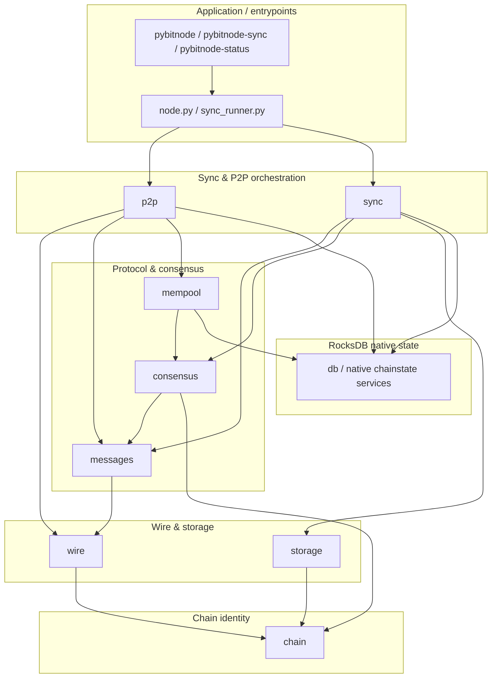

# pybitnode architecture

This document is for contributors who want a map of the codebase: how packages relate, how major operations flow through the system, and how wire “checkpoints” line up with roadmap phases. For runbooks (sync, rebuild, snapshots, **stuck recovery**, [**consensus stall playbook**](OPERATIONS.md#consensus-stall-playbook-invalid-blocks) (**`Rejected invalid block`** / **`events.details_json`**), **parallel vs live DB** safety and [**single writer / lock recap**](OPERATIONS.md#operational-recap-single-writer-lock-checkpoints), **iterative 200-block batches toward ~10k with `--no-header-refresh`** and [`sync_batch_run.log` operators’ log markers](OPERATIONS.md#sync-batch-run-log-markers), **after ~10k: same pattern toward `sync_state.best_height` / header tip** ([batches](OPERATIONS.md#after-10k-validated-continue-toward-the-header-tip-batches)), **snapshot export between batches—not mid-write** ([timing](OPERATIONS.md#when-to-export-snapshots-timing)), **`--no-header-refresh`** [block-sync playbook](OPERATIONS.md#lightweight-block-sync-handshake-no-header-refresh), env var matrix), see [OPERATIONS.md](OPERATIONS.md).

## Package layers

The node is organized in layers from **network bytes** at the bottom to **chain policy and persistence** above. Upper layers depend on lower ones; avoid circular imports across layer boundaries.

### Layer roles

| Layer | Package | Responsibility |
| ----- | ------- | ---------------- |
| Chain | `pybitnode/chain` | Network parameters, genesis, ports, magic—shared facts for wire, storage, and sync. |
| Wire | `pybitnode/wire` | Message framing (`frame`), serialization helpers, and the **wire capability registry** (`capabilities.py`) used for progress tracking. |
| Messages | `pybitnode/messages` | Bitcoin P2P payload types: headers, blocks, transactions, inventory, handshake, etc.—parse/serialize without I/O. |
| P2P | `pybitnode/p2p` | TCP peers, discovery, connection manager, handshake, message loop, optional inbound server, ban scoring. |
| Sync | `pybitnode/sync` | Header pipeline, block download orchestration, structural block/header validation hooks into consensus. |
| Consensus | `pybitnode/consensus` | Proof-of-work checks, merkle/witness, transaction scripts, **UTXO connect/disconnect** (`connect.py`), subsidies, coinbase rules. |
| Storage | `pybitnode/storage` | Raw block files (`blocks/*.dat`) keyed by chain magic. |
| Native state | `pybitnode/db` | RocksDB native state schema and chainstate services: headers, block file pointers, UTXO set, undo data, sync state, phases, wire-capability mirror, event log. |
| Mempool | `pybitnode/mempool` | In-memory transaction pool; admission policy and relay helpers; uses live UTXO view from the tracker for validation. |

Application code (`node.py`, `sync_runner.py`) wires settings, opens the datadir, constructs `PeerManager` / `BlockStore` / native chainstate services, and runs asyncio tasks.

## Data flows

### Header sync

1. **P2P** connects and completes handshake (`p2p/peer.py`, `messages/handshake.py`).
2. **Sync** builds a block locator from RocksDB native state via `sync/headers.py` (`next_locator`).
3. The local node sends **`getheaders`**; the payload on the **`headers`** message is deserialized as `HeadersMessage` (`messages/headers.py`).
4. Each header is validated (`sync/validate.py`) and appended through `persist_headers`, which writes to **native state** and updates `sync_state` (`best_height`, `best_hash`, `sync_status`).
5. When the batch is empty or the local tip catches the peer height, sync status moves to **`headers_current`**.

Operational context: retries across peers when `getheaders` fails, preference for **`PEERS` / `--peers` endpoints**, the **`HEADER_SYNC_NEAR_PEER_TIP` “skip at tip” shortcut**, optional **`SYNC_SKIP_HEADERS`** / **`sync_runner`** align-with-DB skips, **Stuck sync recovery** in [OPERATIONS.md](OPERATIONS.md#stuck-sync-recovery). When headers are already sufficient in RocksDB native state, **`--no-header-refresh` / `NO_HEADER_REFRESH`** skips networked header refresh and uses the **lightweight outbound handshake** (no `sendheaders` / `feefilter` / `mempool` on that outbound)—see [OPERATIONS.md — Lightweight block-sync handshake](OPERATIONS.md#lightweight-block-sync-handshake-no-header-refresh).

### Block sync

1. **Tracker** exposes “missing” block heights compared to stored headers (`list_missing_block_heights`).
2. **P2P** requests witness blocks (`getdata` / `MSG_WITNESS_BLOCK`) from pool peers (`sync/blocks.py`).
3. **`connect_block`** runs on the raw payload first (validation + UTXO advance; see below). If connect fails, the batch stops.
4. On success, bytes are appended to **`storage`** (`BlockStore.write`) and the file pointer is recorded in **`db`** (`record_block`); the node may **`inv`** the new block to peers (`broadcast_witness_block_inv`).

### `connect_block` (validation + UTXO advance)

Implemented in **`consensus/connect.py`**:

1. Enforces sequential height: next block must sit on **`validated_height + 1`**.
2. **`sync/validate`** parses the payload and checks header/link rules (`validate_block`).
3. A transactional **UTXO view** (`_BlockUtxoView`) spends prevouts from the persisted set, verifies scripts (`consensus/script`), accumulates fees, validates coinbase and witness commitment, and creates new UTXOs.
4. **`replace_utxo_undo`** stores undo rows for spends that touched the persisted UTXO set (excluding same-block internal churn).
5. **`view.apply`** commits spends and creations to RocksDB native state; **`set_validated_tip`** advances the validated chain tip.

Operational context: when **`connect_block`** rejects a downloaded block during sync, the tracker logs **`Rejected invalid block`** events; interpreting **`events.details_json`**, the testnet4 **block 6975** Taproot key-path fixture, **`downloaded=0` stalls**, and the Taproot script-path scope note are documented in [OPERATIONS.md — Consensus stall playbook (invalid blocks)](OPERATIONS.md#consensus-stall-playbook-invalid-blocks).

### UTXO undo (reorg / rebuild)

Undo is captured during **`connect_block`** (`_external_spend_undo_entries` + `replace_utxo_undo`).

**`disconnect_block`** (same module) rewinds exactly one validated tip:

1. Load undo snapshot for that height (`take_utxo_undo`).
2. Delete UTXOs created at that height (`delete_utxos_created_at_height`).
3. Re-insert undo entries via `add_utxo`.
4. Roll **`validated_tip`** back to **`height - 1`**.

Rebuild and “connect-only” tooling in **`sync_runner.py`** uses **`rebuild_validated_chain`** / **`connect_stored_blocks`** to replay flat files against this machinery.

### Mempool admission

Inbound **`tx`** messages (`p2p/peer.py`):

1. Deserialize with **`messages/transaction`**.
2. **`mempool.accept_transaction`** applies policy: non-coinbase, sane structure, duplicate-prevout rejection, conflicts with txs already pooled, prevouts must exist in **tracker UTXO set**, per-input script verification, fee sanity, optional **min relay feerate** from **`config.Settings`**.
3. On acceptance, **`Mempool.add`** stores the tx; **`PeerManager`** may relay **`inv(MSG_WITNESS_TX)`** to other peers subject to **`feefilter`**.

The mempool is volatile; persistence of chain state—including UTXOs—is always **`db`** + **`storage`** for blocks.

## Wire capability checkpoints ↔ phases

Checkpoints group binary wire/compatibility criteria. Each checkpoint declares a **`phase`** string that aligns with roadmap tracking in the DB (`phase0`, `phase1`, …). Definitions live in **`pybitnode/wire/capabilities.py`** (`CHECKPOINTS`).

| Checkpoint ID | Scope | Maps to phase |
| --------------- | ----- | ------------- |
| `cp0_framing` | Message framing + transport | `phase0` |
| `cp1_handshake` | version/verack (+ negotiation flags) | `phase0` |
| `cp2_discovery` | DNS seeds, addr, peer pool | `phase0` |
| `cp3_headers` | getheaders/Headers, POW, locator, persistence | `phase1` |
| `cp4_blocks` | Block download via inv/getdata, storage | `phase2` |
| `cp5_tx_relay` | Transaction gossip, mempool, feefilter | `phase4` |
| `cp6_serving` | Inbound getheaders/getdata/block inv | `phase4` |
| `cp7_keepalive` | ping/pong + stale disconnect | `phase0` |
| `cp8_extensions` | Optional protocol extensions (compact blocks, v2 transport, …) | `phase5` |

Implementations mark capabilities in code and via native chainstate records;
aggregates are computed with **`checkpoint_status`** and exposed through
**`pybitnode-status --wire`**.

## Key CLI tools

Defined in **`pyproject.toml`** `[project.scripts]`:

| Command | Entry point | Role |
| ------- | ----------- | ---- |
| **`pybitnode`** | `pybitnode.node:main` | Long-running node: peer bootstrap, header sync, optional block sync/connect, mempool handling, optional inbound listener. |
| **`pybitnode-sync`** | `pybitnode.sync_runner:main` | Batch-oriented workflow: connect P2P, sync headers/blocks and/or **`--connect-only`** replay from **`storage`**, **`--rebuild`** full UTXO replay. |
| **`pybitnode-status`** | `chainstate_status:main` | JSON summary of RocksDB native chainstate: sync state, phases, optional **`--wire`**, **`--checkpoint`**, events. |

Operational flags, **[environment variable matrix](OPERATIONS.md#environment-variable-matrix)**, and recovery steps are documented in [OPERATIONS.md](OPERATIONS.md).
