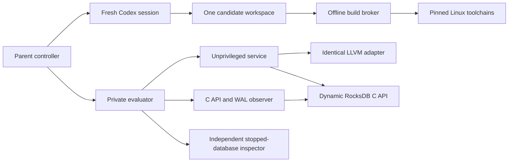

# RosettaNode substrate trial

This compares two independent Zig, Go and Rust host lineages around one frozen
LLVM encoding kernel. It is not a node, consensus extension or official port
benchmark. The parent transfer experiment is read-only; all trial work is here.

The authoritative launch barrier is `evidence/campaign-freeze-v3.json`. Its absence
means no candidate may start. Gate A proves real C API/WAL interception, durable
state inspection, early-ack rejection and the other seeded failures. Gate B adds
v2 recovery, priority and the complete crash matrix. Both precede every lineage.

Preparation commands (before freeze):

```
python3 Nodes/RosettaNode/substrate/tools/qualify.py
python3 Nodes/RosettaNode/substrate/tools/bundle_probe.py
python3 Nodes/RosettaNode/substrate/tools/isolation_probe.py
python3 Nodes/RosettaNode/substrate/tools/build_evaluator.py
```

After clean-environment gate reproduction and measurement-control evidence:

```
python3 Nodes/RosettaNode/substrate/tools/run_trial_v3.py
```

`run_trial_v3.py` retains every round and skips dependent rounds after unresolved
hard failures. It does not replace an attempt. Each round has a fresh local
Codex session, its own audited filesystem, network-disabled tools, offline
Linux toolchains and a parent-owned build broker. The broker mounts only that
workspace and the common adapter. The evaluator runs separately, with candidate
processes under an unprivileged UID. Models never receive evaluator/control code.

Pinned preparation image sources are Dockerfile, Toolchains.Dockerfile and
Evaluator.Dockerfile. Actual image IDs, official archive hashes, Debian package
hashes, loaded library digest and ELF build ID are recorded under evidence/.
The toolchain archives and Rust infrastructure cache are retained locally.
Recreating them requires the exact recorded artifacts, not mutable latest tags.

Contracts define the prior, diagnostics, service wire format and storage schema.
`traces/README.md` records the public/withheld partition. All generators and
contracts are hashed before launch. Rich logs, native build output, datadirs,
transcripts and candidate workspaces stay ignored under `.local/`. Compact
results remain under this directory, outside Project selection.

Performance uses seven fresh-volume repetitions after a separate-volume warm-up,
rotates candidate order and runs serially. Workload 1 leads the comparison;
workload 3 separates baseline sync writes from group commit; workload 4 exposes
mixed-service tails. Database inspection is outside timing. Docker resource
samples are observed maxima, not continuous peaks. Process-crash tests make no
power-loss claim. Candidate source review remains necessary: an LD_PRELOAD shim
is an observer, not a security boundary against deliberately evasive native code.

No winning language is presumed. A Zig failure is not evidence that Zig is a bad
language. Runtime ties within 10% are operational ties, not statistical claims.
Active model time and monetary cost are unknown when the runner does not expose
them; elapsed reading/implementation time, usage events and tool timings remain
separate. See REPORT.md for actual outcomes and limitations.

Evaluator v1 is retained. Its admission-error test incorrectly required a JSON
error response where the contract permitted EOF with diagnostic shutdown. V2
accepts either legal outcome and still rejects early acceptance. Original blind
submissions were reevaluated; v1 repair costs are excluded from language results.
See `evidence/instrument-correction-v2.json`. Do not rerun the superseded v1
controller. Existing attempts are never replaced by the v2 continuation.

Controller v3 separately fixes replay of completed build requests between phases.
Initial wall times from older controllers are descriptive only. Maintenance and
optimization use v3 uniformly. The semantic evaluator remains v2; these versions
are recorded separately in the correction evidence.

## Execution boundaries



The candidate agent cannot read the evaluator, other lineages or the repository.
The service cannot read the private evaluator implementation. Runtime diagnostics
remain observational; source review checks that native write paths do not evade
the required C API. Model rounds and measurements use separate retained records.

To reproduce a qualified submission in a fresh pinned environment:

```
python3 Nodes/RosettaNode/substrate/tools/reproduce.py zig-1 maintenance
```

Use an actually qualified lineage/round. For final measurements after source and
diagnostic review, with no overlapping node benchmark:

```
python3 Nodes/RosettaNode/substrate/tools/measure_resources.py --campaign
```

Service-process samples and whole-container samples are labeled separately.
The service and common evaluator share the four-CPU/four-GiB container quota;
this is not an exclusive reservation of physical host resources. Timing remains
end-to-end and includes the common socket client. It is not a pure FFI microbenchmark.
