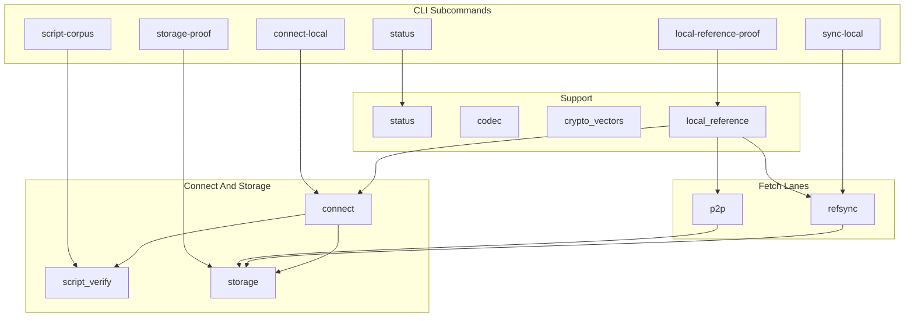

# rsbitnode Architecture

This document maps the Rust implementation: crate modules, major data flows, and
the invariants that keep storage, connect, proof, and comparator surfaces in
one shape. For commands, use [README.md](../README.md). For live
mission-control posture, query Project reports instead of reading this file as
status.

Shared contracts own the cross-port rules:

- [Code documentation philosophy](../../Shared/CODE_DOCUMENTATION.md)
- [Validation pipeline](../../Shared/consensus/VALIDATION_PIPELINE.md)
- [Chainstate store](../../Shared/chainstate/CHAINSTATE_STORE.md)
- [Status contract](../../Shared/STATUS_CONTRACT.md)
- [Docker runtime contract](../../Shared/docker/DOCKER_RUNTIME_CONTRACT.md)
- [Consensus runway](../../Shared/consensus/CONSENSUS_RUNWAY.md)

## Crate Layout

Rust keeps proof, connect, and comparator logic in `src/` with CLI wiring in
`main.rs` subcommands. There is no long-running live node binary yet; runtime
work flows through storage open, connect replay, local Reference fetch, or
bounded P2P fetch.



| Module | Responsibility |
|--------|----------------|
| `refsync` | Local Reference Core RPC fetch, block decode/validate, store raw blocks. |
| `p2p` | Minimal testnet4 client for comparator lanes: handshake, headers, witness blocks. |
| `connect` | Replay stored or decoded blocks with script verification and atomic commit. |
| `script_verify` | Spend-path verification, sighash builders, native secp256k1 backend. |
| `storage` | RocksDB runtime truth, metadata, UTXO, undo, block index, `BlockUtxoView`. |
| `local_reference` | Orchestrates pipeline/staged proof, telemetry, result JSON emission. |
| `status` | Operator JSON from datadir metadata and lock observation. |
| `storage_proof` | Bounded storage/backend proof surface. |
| `script_corpus` | Shared 45-fixture offline harness. |
| `codec` / `crypto_vectors` | Chainstate codec v2 and native crypto vector checks. |
| `tx` | Transaction and block transaction parsing helpers. |

## Entrypoints

CLI subcommands in `main.rs` dispatch to module runners:

- **status** — read runtime truth from RocksDB metadata (`status::build`).
- **storage-proof** — bounded backend proof (`storage_proof::run`).
- **sync-local** — RPC fetch through `refsync::run`.
- **connect-local** — connect replay through `connect::run`.
- **local-reference-proof** — full pipeline via `local_reference::run` (RPC or P2P byte source).
- **script-corpus** — Shared corpus via `script_corpus::run`.
- **codec-vectors** / **native-crypto-vectors** — conformance vector harnesses.

Proof entrypoints write bounded JSON under
`Nodes/Shared/conformance/results/`. They emit evidence for Project import;
they do not read Project for validation decisions.

## P2P Handshake

`p2p::fetch_blocks` uses a minimal outbound client for comparator work. The
handshake path is intentionally simple: `version`, `verack`, then
`sendheaders`. That matches workspace deferred advanced negotiation: this
comparator client does not send relay-oriented messages such as `feefilter`,
`mempool`, or compact-block negotiation.

The local `version` payload advertises `start_height = 0` in `version_payload()`.
For fresh proof volumes or genesis-relative fetches, that is an honest
start_height relative to validated runtime truth at connect time.

This P2P surface is evidence-oriented, not yet a live sync and serving backbone.

## Header And Block Acquisition

**RPC lane (`refsync`)** — sequential Core RPC block fetch, structural
validation, persistence through `storage::Store`.

**P2P lane (`p2p`)** — header chain via `getheaders`, batched witness
`getdata` with configurable prefetch (`FetchOptions::prefetch`,
`RSBITNODE_BLOCK_PREFETCH_DEPTH` in pipeline proof).

Stored block height and validated height remain separate metadata fields until
connect succeeds.

## Block Connect

`connect` is Rust's validation and UTXO mutation boundary. `connect_decoded_block`
and store replay paths:

1. Confirm height connects to validated tip.
2. Parse or accept an already-decoded block.
3. Build a block-local UTXO view (`storage::BlockUtxoView`) for same-block churn.
4. Batch-load external prevouts from RocksDB.
5. Verify scripts through `script_verify` (optional Rayon parallel jobs).
6. Capture undo for external spends.
7. Perform an atomic chainstate commit through `storage::Store`.

The block-local UTXO view resolves same-block creates and spends before durable
UTXO mutation. Connect must stop with a validation blocker record when a rule
is missing or a prevout is absent — never silently succeed.

Pipeline proof prefetches fetch/parse but keeps UTXO apply and RocksDB commit
ordered and single-threaded.

## Script Verification And Sighash

`script_verify` owns spend-path dispatch, legacy/BIP143/BIP341 sighash builders,
and native crypto backend reporting. `script_corpus` proves Shared fixtures
offline.

Stay aligned with Shared fixtures and
[`Docs/script-semantics-gotchas.md`](../../../Docs/script-semantics-gotchas.md).

## Chainstate And Runtime Truth

`storage::Store::open` establishes RocksDB runtime truth under
`<datadir>/chainstate-rocksdb/` with `.rsbitnode_native_storage` marker
metadata.

| Surface | Runtime owner |
|---------|---------------|
| Metadata, sync status, blocker, validated tip | RocksDB via `storage::Store` |
| UTXO and undo | RocksDB UTXO keyspace (codec v2) |
| Lock observation | `.rsbitnode.lock` via `storage::lock_status` |

Status and connect read the store directly. Project reports are mission-control
projections; runtime code must not depend on Project state.

## Single-Writer Datadir Lock

Rust observes `.rsbitnode.lock` for status reporting. Overlapping connect or
storage writers on one datadir are a chainstate integrity risk. Prefer isolated
Docker proof volumes for fresh comparator runs.

## Status, Export, And Proof Surfaces

`status::build` emits operator JSON from active metadata. Proof runners attach
timing summaries (`TimingSummary`, `pipeline_timing_summary`) for benchmark
telemetry import.

Markdown docs may name commands and surfaces; they must not restate latest
pass/fail posture.

## Docker And Local Reference Proof

Follow `Nodes/Shared/docker/ports/rust.docker.json` and the Shared Docker runtime
contract.

| Target | Role |
|--------|------|
| `docker-proof-local` | Official local Reference P2P 5k comparator (`docker_proof_local`). |
| `docker-proof-rpc-replay` | RPC replay evidence lane. |
| `docker-proof-local-fast` | WAL-off diagnostic only; not benchmark-ranked. |
| `docker-probe-external` | Diagnostic public peer evidence only. |

Fresh proof volumes are comparability surfaces, not binary-gate completion.

## Rust-Specific Design Choices

- **Rayon script pool** — parallel input verify within a block when thresholds
  and `RSBITNODE_SCRIPT_VERIFY_PARALLEL` allow; connect ordering preserved.
- **Pipeline prefetch** — bounded fetch/parse ahead of single-threaded connect.
- **Explicit `BlockUtxoView`** — same-block semantics in Rust structs.
- **Integrated local_reference module** — one orchestrator for proof JSON shape
  and telemetry buckets shared with Go/Java timing vocabulary where possible.

## Mission-Control Queries

```bash
python3 Project/scripts/report.py --db Project/project.db --section port-status
python3 Project/scripts/report.py --db Project/project.db --section consensus-runway
python3 Project/scripts/report.py --db Project/project.db --section baseline-5k
python3 Project/scripts/preflight_port_baseline.py --db Project/project.db --port rust --strict
python3 Project/scripts/preflight_consensus_runway.py --db Project/project.db --port rust --stage corpus --strict
```
