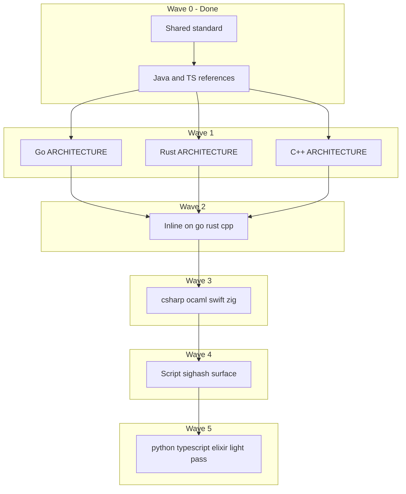

# Comprehensive Code Documentation Rollout

This is the multi-port execution plan for the editorial standard in
[`CODE_DOCUMENTATION.md`](../CODE_DOCUMENTATION.md). It complements — but does
not replace — consensus runway, benchmark gates, or the binary end gate.

## Purpose

RosettaBitcoin ports share one Bitcoin pipeline expressed in many languages.
Documentation should make that pipeline grep-friendly for agents and teachable
for human reviewers without duplicating Shared contracts or embedding stale
Project status in source files.

The completed pilot established:

| Layer | Reference |
|-------|-----------|
| Editorial standard | [`CODE_DOCUMENTATION.md`](../CODE_DOCUMENTATION.md) |
| Examples and review | [`golden_examples.md`](golden_examples.md), [`review_questions.md`](review_questions.md) |
| Agent workflow | [`agent_brief_template.md`](agent_brief_template.md), [`Docs/agent-prompts.md`](../../../Docs/agent-prompts.md) |
| Architecture outline | [`port_architecture_outline.md`](port_architecture_outline.md) |
| Java reference stack | [`Java/docs/ARCHITECTURE.md`](../../Java/docs/ARCHITECTURE.md) + inline anchors |
| TypeScript reference stack | [`TypeScript/docs/ARCHITECTURE.md`](../../TypeScript/docs/ARCHITECTURE.md) + inline anchors |

## Scope Boundaries

**In scope**

- Port `docs/ARCHITECTURE.md` where missing or thin.
- High-signal inline docs at contract boundaries (see surfaces below).
- README links to architecture docs and Project query blocks (no status tables).
- Shared template updates when a new surface pattern repeats across ports.

**Out of scope**

- Executable logic, test expectation, manifest, or proof artifact changes.
- Comment-density tooling or mandatory doc coverage percentages.
- Permanent per-file work queues or tier inventories in Shared docs.
- Restating benchmark rank, lifecycle posture, or binary-gate claims in code.
- Replacing [`Docs/script-semantics-gotchas.md`](../../../Docs/script-semantics-gotchas.md) or Shared contracts with port prose.

**Separate track (not this plan)**

- `tip_once`, `tip_maintenance`, and `post_100k_to_tip` proof work.
- Benchmark harness changes, Docker manifest updates, Project DB imports.

## Documentation Surfaces

Work in **surfaces**, not whole ports. Each surface is one ephemeral brief and
one reviewable batch.

| Surface | Typical files (vary by port) | Canonical vocabulary |
|---------|------------------------------|----------------------|
| **P2P handshake** | peer connection, manager, handshake helpers | deferred advanced negotiation, honest start_height |
| **Sync orchestration** | sync runner, header refresh, batch loop | deferred advanced negotiation, headers vs validated height |
| **Block connect** | connect/block connector, native connect | block-local UTXO view, atomic chainstate commit, validation blocker |
| **Chainstate session** | session open path, store factory | runtime truth, single-writer datadir lock |
| **Datadir lock** | lock file, sync supervisor entry | single-writer datadir lock |
| **Status / proof CLI** | status, storage proof, corpus harness | runtime truth, Project projection |
| **Script / sighash** | verify dispatcher, sighash builders, interpreter entry | validation blocker; link script gotchas |
| **Docker / proof entry** | proof scripts, supervisor docs in README | bounded evidence export; link Docker contract |

Do not document every file in a surface. Anchor the **entrypoints and footguns**
called out in [`golden_examples.md`](golden_examples.md).

## Port Lifecycle Tiers

| Tier | Ports | Architecture doc bar | Inline doc bar |
|------|-------|----------------------|----------------|
| **A — active contenders** | cpp, csharp, go, java, ocaml, rust, swift, zig | Full [`port_architecture_outline.md`](port_architecture_outline.md) | All surfaces above, prioritized P2P → connect → chainstate → script |
| **B — baseline retired** | python, typescript, elixir | Maintain or lightly align existing docs | P2P, lock, connect footguns only; no full-port sweep |
| **C — provenance** | python (extra) | Keep [`OPERATIONS.md`](../../Python/docs/OPERATIONS.md) as runbook | Link Shared vocabulary where ops and architecture overlap |

Java and TypeScript are **tier A references** for architecture shape and inline
density. Python remains the **operations reference** for batch sync and recovery.

## Current Coverage Snapshot

Architecture docs (`docs/ARCHITECTURE.md`):

| Port | Status |
|------|--------|
| java | Complete (reference) |
| typescript | Complete (reference) |
| python | Strong ops/architecture; vocabulary alignment pending |
| go, rust, cpp, csharp, ocaml, swift, zig, elixir | Missing |

Inline canonical vocabulary (grep across port tree):

| Port | P2P | Connect | Chainstate/lock | Status/proof |
|------|-----|---------|-----------------|--------------|
| java | Strong | Strong | Strong | Partial |
| typescript | Strong | Strong | Strong | Partial |
| cpp | Partial | Partial | Partial | Minimal |
| python | Partial | Partial | Partial | Minimal |
| go, rust, csharp, ocaml, swift, zig, elixir | Minimal | Minimal | Minimal | Minimal |

Treat this table as a **starting snapshot**, not a living status board. Re-grep
when planning a batch; do not maintain it by hand in this file.

## Rollout Waves

Execute in waves. Each wave is one or more **scoped PRs** (docs-only).

### Wave 0 — Done

- Shared editorial standard and templates.
- Discoverability in `AGENTS.md`, `CONTRIBUTING.md`, `Docs/agent-prompts.md`.
- Java + TypeScript reference architecture and chainstate/P2P inline pilot.

### Wave 1 — Lead native architecture docs

One port per PR, architecture doc only:

1. **go** — compact `internal/` layout; local Reference P2P comparator.
2. **rust** — module-oriented `src/` layout; storage proof and connect scaffold.
3. **cpp** — header/implementation split; deferred handshake already partially inline.

Each PR:

- Add `Nodes/<Port>/docs/ARCHITECTURE.md` from the outline.
- Link from port README; add Project query block.
- Run `check_doc_drift.py`.

### Wave 2 — Lead native inline boundaries

For go, rust, cpp — one **surface per PR**:

1. P2P handshake surface.
2. Block connect surface.
3. Chainstate session + datadir lock surface.
4. Status / proof CLI surface.

Use port-specific file paths in the brief; preserve canonical vocabulary.

### Wave 3 — Remaining active contenders

Repeat Wave 1 + Wave 2 pattern for **csharp, ocaml, swift, zig** (order flexible;
prefer ports with the most operator traffic or porter demand).

### Wave 4 — Script / sighash surface (active contenders)

Cross-port surface after P2P and connect are anchored:

- Interpreter / verify entrypoints.
- Legacy, witness, taproot sighash builders.
- Link [`Docs/script-semantics-gotchas.md`](../../../Docs/script-semantics-gotchas.md) and Shared rule ledger — do not duplicate trap prose.

One port per PR or one language family per PR (e.g. JVM-style if applicable).

### Wave 5 — Baseline retired alignment

Light pass on **python, typescript, elixir**:

- Python: add Shared links + vocabulary to existing `ARCHITECTURE.md` opening; anchor lock/deferred handshake in `peer.py` / sync entry if missing.
- TypeScript: already aligned; only touch new surfaces as code evolves.
- Elixir: architecture doc optional; inline on supervisor/lock if dual-writer risk exists.

## Batch Workflow

For every batch:

```text
1. Copy ephemeral brief from agent_brief_template.md (or agent-prompts.md).
2. Name one port + one surface only.
3. Read CODE_DOCUMENTATION.md + relevant Shared contracts.
4. Edit docs/comments only.
5. Review with review_questions.md.
6. python3 Project/scripts/check_doc_drift.py
7. Grep canonical vocabulary on the scoped paths only.
8. One commit / PR per batch.
```

**Acceptance grep** (adjust paths per brief):

```bash
rg -n "deferred advanced negotiation|honest start_height|single-writer datadir lock|runtime truth|block-local UTXO view|validation blocker|Project projection" Nodes/<Port>/
```

A batch passes when:

- An agent can skim scoped files faster.
- A language expert learns the Bitcoin invariant at the edit site.
- No status claims were added to source or architecture prose.
- Markdown drift check passes.

## Sequencing Rationale



Prioritize **architecture before wide inline** on each port so agents have a
map before reading scattered comments. Prioritize **P2P and connect before
script** because handshake and UTXO ordering blockers dominate porter time.

## Maintenance Rules

- When Shared contracts change, update **Shared docs first**; port inline docs
  link to contracts, they do not copy them.
- When a port adds a new boundary (new proof CLI, new lock, new connect path),
  add documentation in the **same PR as the code** when possible.
- Do not refresh architecture docs after every Project import; refresh when
  package layout or boundary behavior changes.
- Retire ephemeral briefs after the batch merges; do not accumulate port queues
  in Shared.

## Optional Future Enhancements

Only if repeated pain appears:

- `preflight_doc_surface.py` — read-only grep check that named boundary files
  contain at least one canonical phrase (opt-in per port, not global CI gate).
- Port architecture doc linter — validates required **sections exist**, not
  comment counts.
- Cross-port "same concept, local name" index in Shared (e.g. maps
  `completeDeferredHandshake` ↔ `_lightweight_outbound_handshake`).

None of these are required to execute Waves 1–5.

## Related Commands

```bash
python3 Project/scripts/check_doc_drift.py
python3 Project/scripts/report.py --db Project/project.db --section port-lifecycle
python3 Project/scripts/report.py --db Project/project.db --section port-status
```

Mission-control reports tell you **what the node has proved**. This plan tells
you **how to document the code** that produces those proofs.
