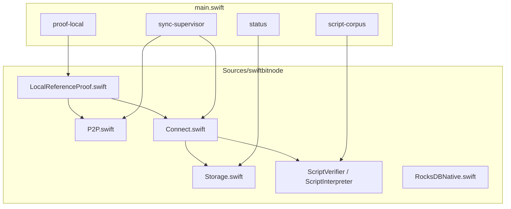

# swiftbitnode Architecture

This document maps the Swift baseline port: CLI proof surfaces, RocksDB runtime
truth, local Reference P2P connect, and the invariants that keep validation
bounded. For commands, use [README.md](../README.md). For live mission-control
posture, query Project reports instead of reading this file as status.

Shared contracts own the cross-port rules:

- [Code documentation philosophy](../../Shared/CODE_DOCUMENTATION.md)
- [Validation pipeline](../../Shared/consensus/VALIDATION_PIPELINE.md)
- [Chainstate store](../../Shared/chainstate/CHAINSTATE_STORE.md)
- [Status contract](../../Shared/STATUS_CONTRACT.md)
- [Docker runtime contract](../../Shared/docker/DOCKER_RUNTIME_CONTRACT.md)
- [Consensus runway](../../Shared/consensus/CONSENSUS_RUNWAY.md)

## Implementation Scope

SwiftNode exposes proof and connect surfaces that Project can import and rank:

- `status`, `script-corpus`, and `proof-local` CLI surfaces
- RocksDB-backed `ChainStore` with Codec v2-style keys
- native libsecp256k1 through C modulemap bindings
- Shared script corpus harness
- local Reference P2P fetch + connect with benchmark telemetry
- `sync-supervisor` for chunked unattended catch-up experiments

Binary testnet4 tip maintenance remains a separate Project gate.
Query Project for imported runway posture instead of treating README notes as
live gate status.

## Module Layout



| Module | Responsibility |
|--------|----------------|
| `P2P.swift` | TCP wire client, handshake, header walk, prefetched block fetch. |
| `Connect.swift` | Block connect, block-local UTXO batch load, script jobs, atomic commit. |
| `Storage.swift` | `ChainStore` — RocksDB runtime truth, datadir lock, blocker recording. |
| `Codec.swift` | Block/transaction parsing for connect. |
| `ScriptVerifier.swift` / `ScriptInterpreter.swift` | Spend-path verification and sighash helpers. |
| `ScriptJobRunner.swift` | Optional parallel script verification within connect. |
| `LocalReferenceProof.swift` | 5k/shakedown proof orchestration and telemetry JSON. |
| `SyncSupervisor.swift` | Chunked sync supervisor with restart-friendly state. |

## Entrypoints

| Command | Role |
|---------|------|
| `status` | Operator JSON from RocksDB-backed runtime truth. |
| `script-corpus` | Offline Shared 45-fixture harness. |
| `proof-local` | Local Reference P2P proof to a target height (default 5k lane). |
| `sync-supervisor` | Multi-chunk catch-up supervisor for operational experiments. |
| `native-crypto-vectors` | Native crypto contract vectors. |
| `consensus-self-test` / `performance-self-test` | Bounded regression harnesses. |

Proof commands write bounded JSON for Project import. They export evidence; they
do not read Project for validation decisions.

## P2P Handshake

`P2PClient.handshake` uses the workspace simple path: `version` → `verack` →
`sendheaders`. That is deferred advanced negotiation during comparator and
catch-up runs — no relay-oriented messages on this path.

`P2PFetcher.fetch` constructs the client with an honest start_height derived
from validated runtime truth (`advertiseHeight ?? startHeight - 1`), not the
header tip on empty state.

## Block Connect

`BlockConnector.connect` is the validation and UTXO mutation boundary:

1. Parses the block and checks sequential attachment to validated tip.
2. Batch-loads external prevouts from RocksDB (same-block spend visibility).
3. Verifies scripts through `ScriptVerifier` (optional `ScriptJobRunner`).
4. Commits through `ChainStore.commitConnectedBlock` — atomic chainstate commit.

Missing rules record a validation blocker via `setBlocker`; do not connect by
assuming success.

## Script Verification And Sighash

`ScriptVerifier`, `ScriptInterpreter`, and `Sighash` implement spend-path
verification. Link traps to
[`Docs/script-semantics-gotchas.md`](../../../Docs/script-semantics-gotchas.md).

## Chainstate And Runtime Truth

Native state lives under the selected datadir:

```text
<datadir>/
  chainstate-rocksdb/
  blocks/block_NNNNNNNN.dat
  .swiftbitnode.lock
```

| Surface | Runtime owner |
|---------|---------------|
| Validated tip, UTXO, undo, sync/blocker metadata | `ChainStore` / `RocksDBNative` |
| Raw block bytes | `blocks/` directory |
| Mutual exclusion | `.swiftbitnode.lock` via `ChainStore` init |

Status and sync read these runtime surfaces. Project reports are mission-control
projections; node code must not depend on Project state.

## Single-Writer Datadir Lock

`ChainStore.init(acquireLock: true)` acquires `.swiftbitnode.lock` before
mutable connect paths. Status-only opens may pass `acquireLock: false`.

## Status, Export, And Proof Surfaces

`Status.build` reads runtime truth without holding the writer lock when
appropriate. Proof JSON belongs under `Nodes/Shared/conformance/results/` for
Project import.

Do not restate latest pass/fail posture in architecture prose.

## Docker And Local Reference Proof

Docker targets mirror `Nodes/Shared/templates/port-baseline-5k/`. Follow
`Nodes/Shared/docker/ports/swift.docker.json` and the Shared Docker runtime
contract.

## Swift-Specific Design Choices

- **Linux + macOS CLI** — `TCPConnection` uses platform sockets; Docker proof
  runs on Linux images.
- **Sendable-heavy connect path** — explicit timing collector and ordered UTXO batch load.
- **Legacy UTXO key fallback** — env-controlled migration helper during RocksDB key evolution.
- **Telemetry-first proof-local** — rich heartbeat JSON for benchmark import gates.

## Mission-Control Queries

```bash
python3 Project/scripts/report.py --db Project/project.db --section port-status
python3 Project/scripts/report.py --db Project/project.db --section consensus-runway
python3 Project/scripts/report.py --db Project/project.db --section baseline-5k
python3 Project/scripts/preflight_port_baseline.py --db Project/project.db --port swift --strict
python3 Project/scripts/preflight_consensus_runway.py --db Project/project.db --port swift --stage corpus --strict
```
