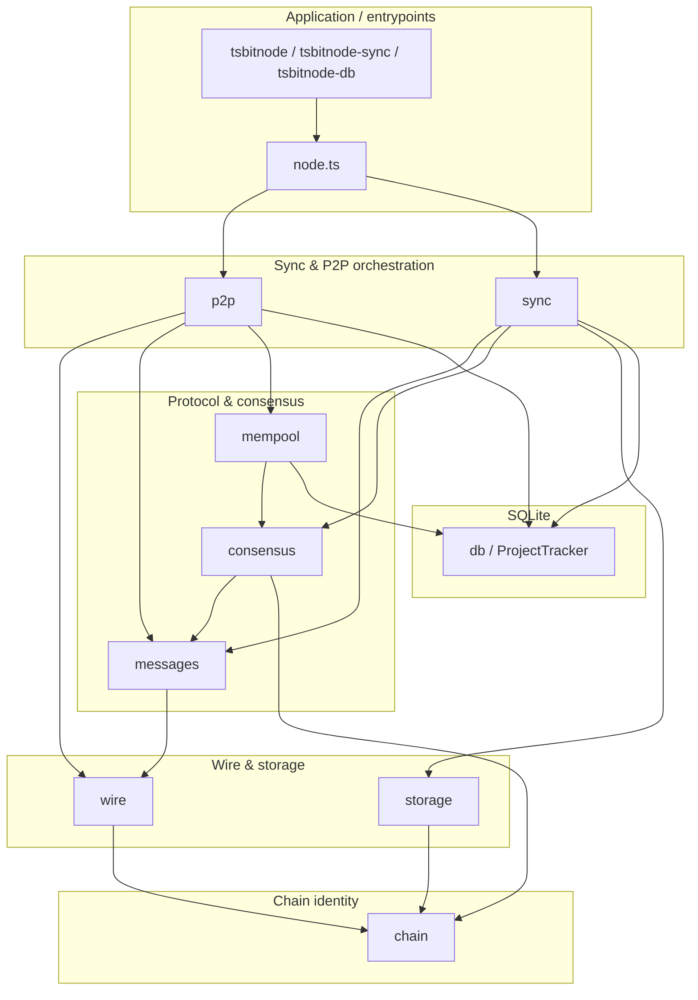

# tsbitnode

Binary-compatible Bitcoin full node in **TypeScript** for **testnet4**. Node.js stdlib (`crypto`, `node:sqlite`) — no bitcoin libraries.

This project mirrors the architecture of [`PythonNode`](../PythonNode) (`pybitnode`) with idiomatic TypeScript: ESM modules, strict typing, async P2P (planned), and the same layered package layout.

## Status

**Foundation + header sync + block download (cp4).** Wire framing, handshake, header sync, getdata/block download, and flat-file block storage are implemented. Consensus validation (`connectBlock`), mempool, and inbound serving remain stubbed for later phases.

There is **no single "project done" flag**. Progress is measured hierarchically, matching PythonNode:

| Layer | What it tracks |
|-------|----------------|
| **Roadmap phases** | 6 phases (`phase0`–`phase5`) in `project_phases`: `pending`, `in_progress`, `completed` |
| **Wire checkpoints** | 9 gates (`cp0_framing` … `cp8_extensions`) |
| **Wire capabilities** | 53 binary flags (43 required) in `wire_capabilities` |
| **`full_node_wire_ready`** | `true` when all 43 required capabilities are implemented |
| **Runtime sync** | `sync_status`: `starting`, `connected`, `headers_syncing`, `headers_current`, `blocks_syncing`, `blocks_current`, `running`, `error` |

Phase auto-updates mirror PythonNode where stubs allow: `phase0`/`phase1` complete on `headers_current`; `phase2`/`phase3` move to `in_progress` during block work; `phase4`/`phase5` remain manual.

### Phase 5 / hardening — Prometheus metrics HTTP

When **`METRICS_HTTP_PORT`** (alias **`METRICS_PORT`**) is **> 0** on the long-running **`tsbitnode`** process, an embedded **`node:http`** listener serves **only** **`GET /metrics`**; other paths return **404**, non-GET returns **405**. Body is Prometheus text exposition (`Content-Type: text/plain; charset=utf-8; version=0.0.4`).

| Series | Type | Labels | Meaning |
| ------ | ---- | ------ | ------- |
| **`blocks_validated_total`** | counter | **`chain`** | Blocks validated and connected (`metric_blocks_validated_total` in SQLite). |
| **`txs_relayed_total`** | counter | **`chain`** | Transactions relayed toward peers (`metric_txs_relayed_total`). |
| **`validated_height`**, **`header_height`**, **`block_count`**, **`utxo_count`** | gauge | **`chain`** | Chain state from tracker / SQLite. |
| **`peer_count`**, **`peer_records_total`** | gauge | **`chain`** | Connected peers and total peer records. |
| **`mempool_tx_count`**, **`mempool_size_bytes`** | gauge | **`chain`** | Mempool meta keys (`mempool_tx_count`, `mempool_size_bytes`). |
| **`sync_status_info`** | gauge | **`chain`**, **`status`** | Current `sync_status` (value `1` on the active status label). |

Implementation: [`src/metrics.ts`](src/metrics.ts) (`prometheusExpositionFormat`) and [`src/metricsHttp.ts`](src/metricsHttp.ts) (`startMetricsServer`). **`METRICS_HTTP_BIND`** defaults to **`127.0.0.1`**; use **`0.0.0.0`** in Docker when the scraper runs in another container. Healthcheck JSON (`tsbitnode-healthcheck`) is separate—use it for Docker probes; scrape **`/metrics`** only from a live node.

```bash
# Live node with metrics on localhost:9090
METRICS_HTTP_PORT=9090 npx tsbitnode --datadir ./data-ts

# Scrape
curl -sS http://127.0.0.1:9090/metrics
```

### Inspect progress

```bash
# Full summary (phases + wire + sync + recent events)
npx tsbitnode-db --db ./data/tsbitnode.db

# Wire capability progress only
npx tsbitnode-db --wire

# Roadmap phases only
npx tsbitnode-db --phases

# Single checkpoint detail
npx tsbitnode-db --checkpoint cp3_headers

# Export snapshots/ for version control
npm run build && npm run export:snapshots -- --db ./data/tsbitnode.db

# Script template survey (read-only DB; classify outputs in blocks ahead of validated tip)
npm run build && npm run survey:scripts -- --db ./data-ts/tsbitnode.db --scan-blocks 20
```

Healthcheck exits non-zero when `sync_status === "error"`. See [`snapshots/README.md`](snapshots/README.md) for the export workflow.

## Operations

Operational runbook for batch sync, progress reporting, connect-only validation, and running alongside PythonNode. Paths assume repo root (`TypeScriptNode/`). PythonNode’s equivalent docs live in [`../PythonNode/docs/OPERATIONS.md`](../PythonNode/docs/OPERATIONS.md).

### Safe parallel work vs the live database

**Single writer rule:** SQLite under `datadir` (`tsbitnode.db`) must have **at most one** active writer among `tsbitnode-sync`, long-running `tsbitnode`, or any script that opens the tracker for mutation.

| Goal | Approach |
|------|----------|
| Inspect metrics / JSON dashboards | Run `npm run export:snapshots` against a **quiescent** DB, query with `tsbitnode-db`, or copy the DB when nothing is writing and open the copy read-only. |
| Experiment with sync flags | Point at a **separate `--datadir`** (full clone or fresh sync), not the production disk. |
| Long batch jobs in parallel | Run **different datadirs** (one process each). TypeScriptNode defaults to **`./data-ts`**; PythonNode typically uses **`./data`**. |

**Between batch runs** (same datadir): let each `tsbitnode-sync` exit cleanly before starting the next invocation. Export snapshots after stopping if you want a checkpoint on disk.

### Batch block sync (`tsbitnode-sync`)

Typical iterative catch-up toward a validation height limit:

```bash
DATA_DIR=./data-ts npx tsbitnode-sync \
  --datadir ./data-ts \
  --blocks-target 10000 \
  --blocks-max 200 \
  --peers HOST:PORT
```

| Flag | Role |
|------|------|
| `--blocks-max` | Upper bound on blocks validated this **run** (often **200** for predictable chunks). |
| `--blocks-target` | Stop once `validated_height` reaches this height. |
| `--peers` | Optional comma-separated `host:port` list; otherwise DNS seed discovery applies. |
| `--datadir` / `--db` | Data directory (`./data-ts`) or explicit SQLite path. |
| `--connect-only` | Validate stored blocks only (no P2P download). |
| `--no-header-refresh` | Trust headers already in SQLite; use for staged block batches. |

### Batch loop helper

**`scripts/sync_batch_loop.sh`** → **`dist/scripts/syncBatchLoop.js`**. One orchestrator per datadir via **`<datadir>/.sync_batch_loop.lock`**; **`validated_height`** is polled read-only between batches (no SQLite writer during polls).

```bash
npm run build
MAX_OUTBOUND_PEERS=1 PARALLEL_BLOCK_DOWNLOADS=0 SKIP_GETADDR=1 \
  ./scripts/sync_batch_loop.sh \
  --datadir ./data-ts \
  --target 10000 \
  --blocks-max 200 \
  --no-header-refresh \
  --peers HOST:PORT \
  --log ./sync_batch_run.log
```

Pass additional **`tsbitnode-sync`** flags after `--` (example: `./scripts/sync_batch_loop.sh … -- --connect-only`). Or use **`npm run sync:batch -- …`** with the same arguments.

Batch markers in **`sync_batch_run.log`** match PythonNode’s format so tooling can parse partial runs:

```text
=== batch 3 start_validated=8400 2026-05-26T02:41:52Z ===
=== batch 3 end_validated=8600 downloaded_delta=200 exit=0 (2026-05-26T02:53:41Z) validated_delta=200 ===
```

### Progress report

Summarize sync progress from the batch log and/or read-only DB:

```bash
npm run sync:progress -- --db ./data-ts/tsbitnode.db --target 10000
# or
./scripts/sync_progress_report.sh --db ./data-ts/tsbitnode.db --target 10000 --json
```

Text output includes **`validated_height`**, **`header_height`**, **`block_count`**, **`sync_status`**, and **`pct_to_target`**. With **`--json`**, the same fields are emitted as one JSON object.

Bare **`--db`** defaults to **`./data-ts/tsbitnode.db`**. Without **`--db`**, height is inferred from the latest batch markers in **`--log`** (default **`./sync_batch_run.log`**).

### Connect-only workflow

When blocks are already on disk but validation lags:

```bash
npx tsbitnode-sync --datadir ./data-ts --connect-only
# rebuild validated chain from stored blocks (destructive to UTXO state):
npx tsbitnode-sync --datadir ./data-ts --connect-only --rebuild
```

Use **`--connect-only`** inside the batch loop for validation-only passes: `./scripts/sync_batch_loop.sh … -- --connect-only`.

### Stuck sync recovery

**Header sync failures:** Header download tries peers in order (`--peers` first, then by advertised height). On each sync start, `repairSyncState` realigns `sync_state` with the highest row in `headers`—useful after a crash mid-headers.

**Inspect state:**

```bash
npx tsbitnode-db --db ./data-ts/tsbitnode.db
```

**“Too advanced state” / peer disconnects:** If the DB has headers far ahead of validated blocks, do **not** advertise the header tip during block-only sync. `tsbitnode-sync` now sets `version.start_height` from **`validated_height`** when `--no-header-refresh` or `SYNC_SKIP_HEADERS=1` is active (matching PythonNode). For full header catch-up, it uses the local header tip after `repairSyncState`.

**Automatic repair on sync start:**

- `repairSyncState` — aligns `sync_state.best_height` with stored headers
- `repairValidatedIfAhead` — rebuilds validation when `validated_height` exceeds stored blocks

**Recommended block-only batch** (headers already in SQLite):

```bash
MAX_OUTBOUND_PEERS=1 PARALLEL_BLOCK_DOWNLOADS=0 SKIP_GETADDR=1 \
  npx tsbitnode-sync \
  --datadir ./data-ts \
  --peers 89.167.10.150:48333 \
  --no-header-refresh \
  --blocks-target 100000 \
  --blocks-max 200
```

**Fresh or error DB:** Each run sets `sync_status` to `starting`, seeds genesis via `ensureGenesis`, runs `repairSyncState`, then connects before header/block work. Clear persistent errors by completing a successful sync run or inspect `last_error` via `tsbitnode-db`.

See [`../PythonNode/docs/OPERATIONS.md`](../PythonNode/docs/OPERATIONS.md) for the full PythonNode runbook (architecture is mirrored).

### Snapshot export workflow

Export tracker JSON **between batches** when the DB is quiescent (not mid-write). Commit refreshed `snapshots/` after milestones (checkpoint pass, phase completion, batch target reached):

```bash
npm run build && npm run export:snapshots -- --db ./data-ts/tsbitnode.db
git add snapshots/ && git commit -m "Update tracker snapshots"
```

See [`snapshots/README.md`](snapshots/README.md) for file layout and git workflow.

### Running in parallel with PythonNode

Both nodes can sync testnet4 concurrently when they use **separate datadirs and databases**:

| | PythonNode | TypeScriptNode |
|---|------------|----------------|
| Default datadir | `./data` | `./data-ts` |
| DB file | `pybitnode.db` | `tsbitnode.db` |
| Sync CLI | `pybitnode-sync` | `tsbitnode-sync` |
| Batch loop | `PythonNode/scripts/sync_batch_loop.sh` | `TypeScriptNode/scripts/sync_batch_loop.sh` |

Use **different manual peers** or accept independent peer selection if you want to compare download behavior. Do **not** point both nodes at the same `--datadir` / DB file.

Example side-by-side batch sync:

```bash
# Terminal A (PythonNode)
cd ../PythonNode && ./scripts/sync_batch_loop.sh --datadir ./data --target 10000 --blocks-max 200

# Terminal B (TypeScriptNode)
cd TypeScriptNode && ./scripts/sync_batch_loop.sh --datadir ./data-ts --target 10000 --blocks-max 200
```

Progress checks:

```bash
# PythonNode
python ../PythonNode/scripts/sync_progress_report.py --db ./data/pybitnode.db --target 10000

# TypeScriptNode
npm run sync:progress -- --db ./data-ts/tsbitnode.db --target 10000
```

| Layer | Status |
|-------|--------|
| chain | testnet4 + regtest params, genesis |
| wire | message framing + capability registry seed |
| db | SQLite schema + ProjectTracker |
| messages | handshake, headers, inv/getdata/block |
| p2p | outbound connect, header sync, block download |
| sync | header sync + block download (validation basic) |
| storage | blk*.dat append-only store |
| consensus / mempool | stubs (phase3+) |

## Setup

```bash
npm install
npm run build
npm test
```

Requires **Node.js ≥ 20**.

## Commands

```bash
# Run node (foundation — initializes datadir + tracker)
npx tsbitnode --datadir ./data

# Sync headers then blocks to a target height (separate datadir from PythonNode)
DATA_DIR=./data-ts npx tsbitnode-sync --datadir ./data-ts --blocks-target 5000 --blocks-max 200

# Tracker / progress summary
npx tsbitnode-db --db ./data-ts/tsbitnode.db

# Development (no build step)
npm run dev -- --datadir ./data
```

Environment variables match PythonNode where applicable (`CHAIN`, `DATA_DIR`, `DB_PATH`, `PEERS`, `LISTEN`, `NO_HEADER_REFRESH`, etc.). See `src/config/settings.ts`.

**Peer defaults (differs from PythonNode):** PythonNode operational scripts and docs use manual peer **`89.167.10.150:48333`** (`PEERS` / `--peers` / `SYNC_PEER` in `.tmp_continue_sync_batches.sh`). TypeScriptNode defaults to **DNS seed discovery** (`seed.testnet4.bitcoin.sprovoost.nl`, `seed.testnet4.wiz.biz`) and **excludes `89.167.10.150`** when resolving seeds or when alternate manual peers are configured. Override with `PEERS=host:port` if needed.

## Layout

```
src/
  chain/       testnet4 params, genesis
  wire/        message framing, capability registry
  messages/    version, headers, tx, block, inv (stubs)
  p2p/         peer connections, discovery, manager (stubs)
  sync/        header + block sync, validation (stubs)
  consensus/   PoW, UTXO connect (stubs)
  storage/     blk*.dat block files (partial)
  db/          SQLite schema + ProjectTracker
  mempool/     tx pool (stub)
  cli/         tsbitnode, tsbitnode-sync, tsbitnode-db entrypoints
tests/         vitest unit tests
```

## Relationship to PythonNode

| PythonNode | TypeScriptNode |
|------------|----------------|
| `pybitnode` | `tsbitnode` |
| `pybitnode-sync` | `tsbitnode-sync` |
| `pybitnode-db` | `tsbitnode-db` |
| `pybitnode.db` | `tsbitnode.db` |
| `sqlite-utils` | `node:sqlite` (built-in) |
| `asyncio` P2P | Node.js `net` + async (planned) |
| `docs/ARCHITECTURE.md` | same layer model (see below) |

Both nodes target **binary wire compatibility** with Bitcoin Core on testnet4, track progress via wire capability checkpoints (`cp0_framing` … `cp8_extensions`), and persist chain state in SQLite with flat `blocks/blk*.dat` files.

For the full architecture map (layers, data flows, checkpoints), see [docs/ARCHITECTURE.md](docs/ARCHITECTURE.md). PythonNode’s equivalent: [`../PythonNode/docs/ARCHITECTURE.md`](../PythonNode/docs/ARCHITECTURE.md).

## Architecture (summary)

See [docs/ARCHITECTURE.md](docs/ARCHITECTURE.md) for the complete map. Layer overview:



## Next steps

1. **Wire + handshake** — port `messages/handshake.py`, `p2p/peer.py` version/verack loop
2. **P2P discovery** — DNS seeds, TCP connect, `PeerManager.bootstrap`
3. **Header sync** — `getheaders` / `headers`, `sync/validate`, tracker persistence
4. **Block download + storage** — `getdata`, `BlockStore.read`, file pointer rows
5. **Consensus** — `connect_block`, script interpreter, pure TypeScript secp256k1 (port from PythonNode; `node:crypto` for SHA256/tagged hashes only)
6. **Mempool + relay** — admission policy, feefilter, orphan pool
7. **Inbound serving** — `serveInbound`, getheaders/getdata responses
8. **Protocol extensions** — compact blocks (BIP152), sendheaders, v2 transport

## License

MIT

## Docker

```bash
docker compose -f docker/docker-compose.yml up
```

Build and run in the background:

```bash
docker compose -f docker/docker-compose.yml up -d --build
```

The compose file maps host port **48333** to testnet4 P2P, mounts a named volume at **`/data`**, sets **`LISTEN=1`**, and probes health via `node dist/cli/healthcheck.js` (one JSON line on stdout; exit **1** when tracker `sync_status` is **`error`**).

Inspect health manually:

```bash
docker compose -f docker/docker-compose.yml exec tsbitnode node dist/cli/healthcheck.js
```

Stop and remove containers (keeps the data volume):

```bash
docker compose -f docker/docker-compose.yml down
```
