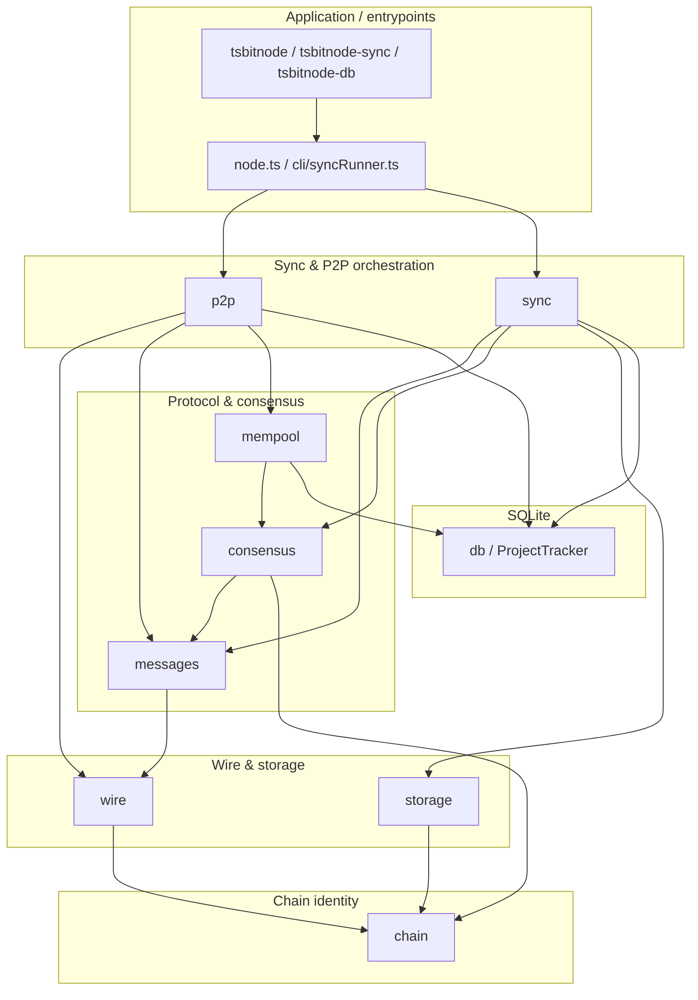

# tsbitnode architecture

This document is for contributors who want a map of the codebase: how packages relate, how major operations flow through the system, and how wire “checkpoints” line up with roadmap phases. For runbooks (sync, rebuild, snapshots, batch loops, parallel vs live DB safety), see [README — Operations](../README.md#operations).

## Hierarchical “done” model

There is **no single project-done flag**. Progress is tracked at four levels, mirrored from PythonNode (`pybitnode`):

| Layer | Storage | Meaning |
| ----- | ------- | ------- |
| **Roadmap phases** | `project_phases` | Six phases (`phase0`–`phase5`): `pending`, `in_progress`, `completed`. |
| **Wire checkpoints** | derived from `wire_capabilities` | Nine gates (`cp0_framing` … `cp8_extensions`) grouping related binary criteria. |
| **Wire capabilities** | `wire_capabilities` | 53 binary flags (43 required); each marks a specific wire or serving behavior. |
| **`full_node_wire_ready`** | computed | `true` when all 43 required capabilities are implemented. |
| **Runtime sync** | `sync_state.sync_status` | Live chain sync: `starting` → `connected` → `headers_syncing` / `headers_current` → `blocks_syncing` / `blocks_current` → `running` or `error`. |

Inspect progress:

```bash
npx tsbitnode-db --db ./data-ts/tsbitnode.db          # full summary
npx tsbitnode-db --wire                               # wire + checkpoints
npx tsbitnode-db --checkpoint cp6_serving             # single checkpoint
npm run build && npm run export:snapshots -- --db ./data-ts/tsbitnode.db
```

Commit refreshed `snapshots/` after milestones — see [snapshots/README.md](../snapshots/README.md).

## Package layers

The node is organized in layers from **network bytes** at the bottom to **chain policy and persistence** above. Upper layers depend on lower ones; avoid circular imports across layer boundaries.



### Layer roles

| Layer | Package | Responsibility |
| ----- | ------- | ---------------- |
| Chain | `src/chain` | Network parameters, genesis, ports, magic—shared facts for wire, storage, and sync. |
| Wire | `src/wire` | Message framing (`frame.ts`), serialization helpers, and the **wire capability registry** (`capabilities.ts`) used for progress tracking. |
| Messages | `src/messages` | Bitcoin P2P payload types: headers, blocks, transactions, inventory, handshake, etc.—parse/serialize without I/O. |
| P2P | `src/p2p` | TCP peers, discovery, connection manager, handshake, message loop, inbound server (`server.ts`), ban scoring. |
| Sync | `src/sync` | Header pipeline, block download orchestration, structural block/header validation hooks into consensus. |
| Consensus | `src/consensus` | Proof-of-work checks, merkle/witness, transaction scripts, **UTXO connect/disconnect** (`connect.ts`), subsidies, coinbase rules. |
| Storage | `src/storage` | Raw block files (`blocks/*.dat`) keyed by chain magic. |
| DB | `src/db` | SQLite schema and `ProjectTracker`: headers, block file pointers, UTXO set, undo data, sync state, phases, wire-capability mirror, event log. |
| Mempool | `src/mempool` | In-memory transaction pool; admission policy and relay helpers; uses live UTXO view from the tracker for validation. |

Application code (`node.ts`, `cli/syncRunner.ts`) wires settings, opens the datadir, constructs `PeerManager` / `BlockStore` / `ProjectTracker`, and runs async P2P tasks.

## Data flows

### Header sync

1. **P2P** connects and completes handshake (`p2p/peer.ts`, `messages/handshake.ts`).
2. **Sync** builds a block locator from SQLite via `sync/headers.ts` (`nextLocator`).
3. The local node sends **`getheaders`**; the payload on the **`headers`** message is deserialized as `HeadersMessage` (`messages/headers.ts`).
4. Each header is validated (`sync/validate.ts`) and appended through `persistHeaders`, which writes to **`db`/tracker** and updates `sync_state` (`best_height`, `best_hash`, `sync_status`).
5. When the batch is empty or the local tip catches the peer height, sync status moves to **`headers_current`**.

When headers are already sufficient in SQLite, **`--no-header-refresh` / `NO_HEADER_REFRESH`** skips networked header refresh and uses the lightweight outbound handshake path.

### Block sync

1. **Tracker** exposes missing block heights compared to stored headers.
2. **P2P** requests witness blocks (`getdata` / `MSG_WITNESS_BLOCK`) from pool peers (`sync/blocks.ts`).
3. **`connectBlock`** runs on the raw payload first (validation + UTXO advance). If connect fails, the batch stops.
4. On success, bytes are appended to **`storage`** (`BlockStore.write`) and the file pointer is recorded in **`db`** (`recordBlock`); the node may **`inv`** the new block to peers (`broadcastWitnessBlockInv`).

### `connectBlock` (validation + UTXO advance)

Implemented in **`consensus/connect.ts`**:

1. Enforces sequential height: next block must sit on **`validated_height + 1`**.
2. **`sync/validate`** parses the payload and checks header/link rules (`validateBlock`).
3. A transactional **UTXO view** spends prevouts from the persisted set, verifies scripts (`consensus/script`), accumulates fees, validates coinbase and witness commitment, and creates new UTXOs.
4. **`replaceUtxoUndo`** stores undo rows for spends that touched the persisted UTXO set.
5. **`view.apply`** commits spends and creations to SQLite; **`setValidatedTip`** advances the validated chain tip.

### Mempool admission

Inbound **`tx`** messages (`p2p/peer.ts`):

1. Deserialize with **`messages/transaction.ts`**.
2. **`mempool.acceptTransaction`** applies policy: non-coinbase, sane structure, duplicate-prevout rejection, conflicts with txs already pooled, prevouts must exist in **tracker UTXO set**, per-input script verification, fee sanity, optional **min relay feerate** from **`config/settings.ts`**.
3. On acceptance, **`Mempool.add`** stores the tx; **`PeerManager`** may relay **`inv(MSG_WITNESS_TX)`** to other peers subject to **`feefilter`**.

The mempool is volatile; persistence of chain state—including UTXOs—is always **`db`** + **`storage`** for blocks.

### Inbound serving (cp6)

When **`LISTEN=1`**, `serveInbound` accepts TCP connections and runs **`serveInboundSession`**:

1. Inbound handshake via **`PeerConnection.acceptInbound`**.
2. **`dispatchInboundMessage`** routes **`getheaders`** to **`buildHeadersResponse`** (`p2p/headerServing.ts`) and **`getdata`** to **`handleInboundGetdata`** (`p2p/server.ts`).
3. Block **`getdata`** reads flat files via **`BlockStore.read`**; tx **`getdata`** serves from **`Mempool`** when present.
4. Successful serves mark wire capabilities: `serve.getheaders`, `serve.getdata.blocks`, `serve.getdata.txs`.

## Wire capability checkpoints ↔ phases

Checkpoints group binary wire/compatibility criteria. Each checkpoint declares a **`phase`** string that aligns with roadmap tracking in the DB (`phase0`, `phase1`, …). Definitions live in **`src/wire/capabilities.ts`** (`CHECKPOINTS`).

| Checkpoint ID | Scope | Maps to phase |
| ------------- | ----- | ------------- |
| `cp0_framing` | Message framing + transport | `phase0` |
| `cp1_handshake` | version/verack (+ negotiation flags) | `phase0` |
| `cp2_discovery` | DNS seeds, addr, peer pool | `phase0` |
| `cp3_headers` | getheaders/Headers, POW, locator, persistence | `phase1` |
| `cp4_blocks` | Block download via inv/getdata, storage | `phase2` |
| `cp5_tx_relay` | Transaction gossip, mempool, feefilter | `phase4` |
| `cp6_serving` | Inbound getheaders/getdata/block inv | `phase4` |
| `cp7_keepalive` | ping/pong + stale disconnect | `phase0` |
| `cp8_extensions` | Optional protocol extensions (compact blocks, v2 transport, …) | `phase5` |

Implementations mark capabilities in code and via **`ProjectTracker`** (mirrored rows); aggregates are computed with **`checkpointStatus`** and exposed through **`tsbitnode-db --wire`**.

## Key CLI tools

Defined in **`package.json`** `bin`:

| Command | Entry point | Role |
| ------- | ----------- | ---- |
| **`tsbitnode`** | `dist/cli/node.js` | Long-running node: peer bootstrap, header sync, optional block sync/connect, mempool handling, optional inbound listener. |
| **`tsbitnode-sync`** | `dist/cli/syncRunner.js` | Batch-oriented workflow: connect P2P, sync headers/blocks and/or **`--connect-only`** replay from **`storage`**, **`--rebuild`** full UTXO replay. |
| **`tsbitnode-db`** | `dist/cli/dbStatus.js` | JSON summary of SQLite tracker: sync state, phases, optional **`--wire`**, **`--checkpoint`**, events. |
| **`tsbitnode-healthcheck`** | `dist/cli/healthcheck.js` | One-line JSON health probe; exit **1** when `sync_status === "error"`. |

Helper scripts (built to `dist/scripts/`):

| npm script | Role |
| ---------- | ---- |
| **`export:snapshots`** | Export tracker JSON to `snapshots/` for version control. |
| **`sync:batch`** | Iterative batch sync loop with lock file and log markers. |
| **`sync:progress`** | Read-only progress report from batch log and/or DB. |

## Testing

Vitest unit and integration tests live in **`tests/`**. CI runs `npm run typecheck`, `npm run build`, and `npm test` on Node 20 and 22, plus Docker Compose config validation and a CLI smoke test for `syncProgressReport`.

Key integration coverage:

- **`inboundServe.test.ts`** — cp6 getheaders/getdata serving paths with mocked peers.
- **`syncIntegrationSmoke.test.ts`** — `runNode` sync-only loop with mocked `PeerManager` (no live network).
- **`peerTxRelay.test.ts`** — inv/getdata relay and feefilter gating.

## Relationship to PythonNode

TypeScriptNode mirrors PythonNode’s layer model, wire capability registry, SQLite schema, and CLI surface. Differences:

- **Runtime**: Node.js `net` + async/await (vs Python `asyncio`).
- **SQLite**: `node:sqlite` built-in (vs `sqlite-utils`).
- **Default peers**: DNS seed discovery; PythonNode ops docs use manual peer `89.167.10.150:48333`.
- **Default datadir**: `./data-ts` (vs PythonNode `./data`).

For PythonNode’s operational runbook, see [`../PythonNode/docs/OPERATIONS.md`](../PythonNode/docs/OPERATIONS.md).
