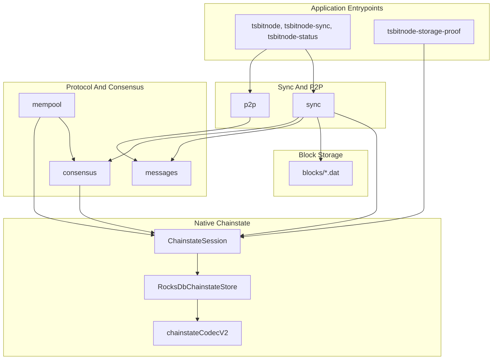

# tsbitnode architecture

This document maps the native/Core TypeScript implementation. For runbooks, see
[`README.md`](../README.md). Legacy SQLite tracker tooling is documented only as
handoff evidence and compatibility.

## Native Done Model

There is no single project-done flag. Progress is tracked through chainstate
status, storage proof artifacts, wire checkpoints, and blocker ledgers.

Inspect native status:

```bash
npm run build
npx tsbitnode-status --datadir ./data-ts
npx tsbitnode-storage-proof --datadir ./data-ts-proof
```

Inspect legacy SQLite evidence only when explicitly needed:

```bash
npx tsbitnode-legacy-db --db ./data-ts/tsbitnode.db --wire
```

## Package Layers



## Layer Roles

| Layer | Package | Responsibility |
|-------|---------|----------------|
| Chain | `src/chain` | Network parameters, genesis, ports, magic. |
| Wire | `src/wire` | Message framing, serialization helpers, and wire capability registry. |
| Messages | `src/messages` | Bitcoin P2P payload parse/serialize code. |
| P2P | `src/p2p` | Peers, discovery, connection manager, handshake, inbound serving. |
| Sync | `src/sync` | Header pipeline, block download orchestration, structural validation hooks. |
| Consensus | `src/consensus` | PoW, merkle/witness, transaction scripts, UTXO connect/disconnect. |
| Storage | `src/storage` | Raw block files and native chainstate codec helpers. |
| Chainstate | `src/chainstate` | RocksDB-owned operational truth: headers, block index, sync state, validated tip, UTXO, undo, metadata. |
| Legacy SQLite | `src/db` | Compatibility tracker/schema for old snapshots, surveys, and repair notes only. |

## Data Flows

### Header Sync

1. P2P connects and completes handshake.
2. Sync builds a locator from native chainstate when running in Core/native mode.
3. Headers are validated and persisted through `ChainstateSession` and the active chainstate store.
4. `sync_status` moves through `headers_syncing` to `headers_current` when caught up.

### Block Sync

1. Sync finds the next needed block height from native headers and validated tip.
2. P2P requests witness blocks with `getdata` / `MSG_WITNESS_BLOCK`.
3. Consensus validation and UTXO updates happen before bytes are accepted as connected.
4. Raw bytes are stored in `blocks/`; block index and validated tip live in native chainstate.

### Native Storage Proof

`tsbitnode-storage-proof` starts from a fresh datadir, rejects `tsbitnode.db`, writes
RocksDB chainstate records, records proof metadata, and emits proof JSON under
`NodeCore/conformance/results/`.

## CLI Tools

| Command | Entry point | Role |
|---------|-------------|------|
| `tsbitnode` | `dist/cli/node.js` | Long-running node. |
| `tsbitnode-sync` | `dist/cli/syncRunner.js` | Batch sync / connect-only replay. |
| `tsbitnode-status` | `dist/cli/nativeStatus.js` | Native RocksDB chainstate status. |
| `tsbitnode-storage-proof` | `dist/cli/storageProof.js` | Bounded native storage proof. |
| `tsbitnode-healthcheck` | `dist/cli/healthcheck.js` | JSON health probe for runtime checks. |
| `tsbitnode-legacy-db` | `dist/cli/dbStatus.js` | Legacy SQLite tracker status; not a Core/native proof. |

## Relationship To Python

TypeScript follows the same full-break rule now applied to Python: old SQLite
state is historical evidence, and forward parity must be reproved from an empty
native datadir. Python uses RocksDB through `rocksdict`; TypeScript uses the
RocksDB npm binding and scoped native crypto dependencies.
