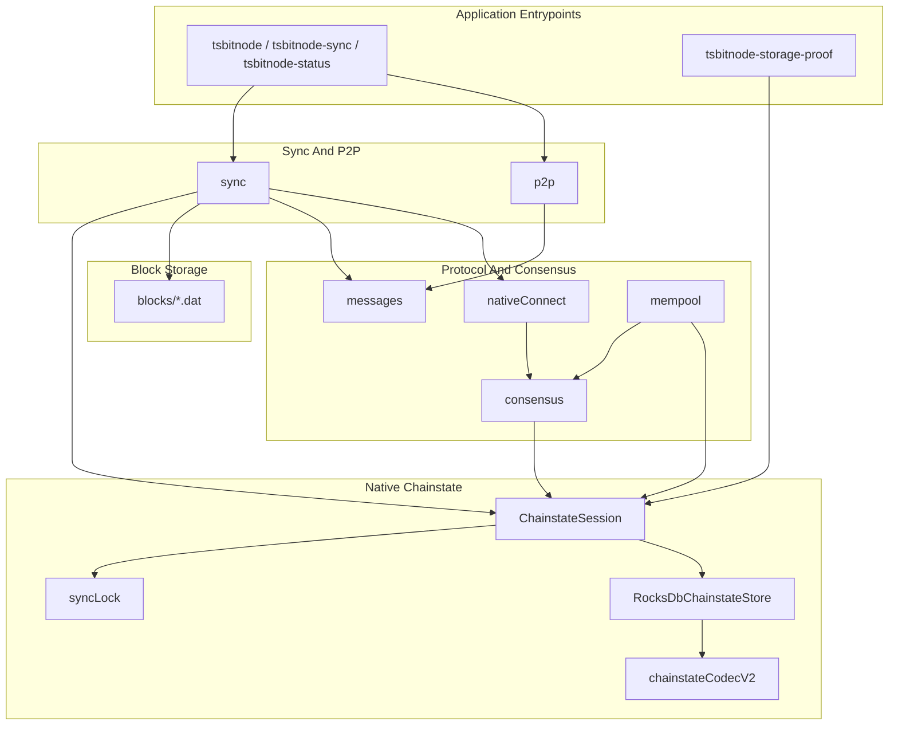

# tsbitnode Architecture

This document maps the TypeScript native/Core implementation: package roles,
major data flows, and the invariants that keep P2P, validation, chainstate, and
proof surfaces in one shape. For commands, use [README.md](../README.md). For
live mission-control posture, query Project reports instead of reading this
file as status.

Shared contracts own the cross-port rules:

- [Code documentation philosophy](../../Shared/CODE_DOCUMENTATION.md)
- [Validation pipeline](../../Shared/consensus/VALIDATION_PIPELINE.md)
- [Chainstate store](../../Shared/chainstate/CHAINSTATE_STORE.md)
- [Status contract](../../Shared/STATUS_CONTRACT.md)
- [Docker runtime contract](../../Shared/docker/DOCKER_RUNTIME_CONTRACT.md)
- [Consensus runway](../../Shared/consensus/CONSENSUS_RUNWAY.md)

## Package Layers

TypeScript keeps orchestration, wire parsing, consensus, and native chainstate
in separate packages. CLI entrypoints are thin shims; service modules own
runtime wiring.



| Layer | Package | Responsibility |
|-------|---------|----------------|
| Chain | `src/chain` | Network parameters, genesis, ports, magic. |
| Wire | `src/wire` | Message framing, serialization helpers, wire capability registry. |
| Messages | `src/messages` | Bitcoin P2P payload parse/serialize code without socket ownership. |
| P2P | `src/p2p` | Peers, discovery, connection manager, handshake, inbound serving. |
| Sync | `src/sync` | Header pipeline, block download orchestration, structural validation hooks. |
| Consensus | `src/consensus` | PoW, merkle/witness, transaction scripts, native block connect. |
| Storage | `src/storage` | Raw block files, sync lock, native chainstate codec helpers. |
| Chainstate | `src/chainstate` | RocksDB-owned runtime truth: headers, block index, sync state, validated tip, UTXO, undo, metadata. |
| CLI and proof | `src/cli` | Operator commands, status export, storage proof, Docker proof entrypoints. |

`src/db/` remains a compatibility namespace for legacy tracker-based snapshots
and surveys. Do not add new native/Core code there.

## Entrypoints

`tsbitnode-sync` (`syncRunner.ts`) is the normal batch sync entrypoint. It opens
a `ChainstateSession`, connects through `PeerManager`, runs header sync unless
`--no-header-refresh` is set, then drives block download and connect.

`tsbitnode` (`node.ts`) is the long-running node service surface. It shares the
same P2P and chainstate primitives, but live serving and relay behavior must
respect the Shared status and P2P contracts before advancing beyond initial sync
behavior.

`tsbitnode-status` (`nativeStatus.ts`) reads the active RocksDB-backed state and
prints operator JSON. It exposes runtime truth; Project may later import that
truth as a Project projection, but node code must not depend on Project state.

`tsbitnode-storage-proof` and Docker proof targets are proof surfaces. They are
meant to emit bounded evidence, not to become alternate runtime stores.

## P2P Handshake

`PeerConnection` (`p2p/peer.ts`) owns the outbound testnet4 socket and message
loop. During initial sync it uses the workspace simple path: `version`, `verack`,
`sendheaders`, then header or block requests. That is deliberate deferred
advanced negotiation: relay-oriented messages such as `feefilter`, `mempool`,
and compact-block negotiation wait until the node has the runtime mode and
validated state required to make them honest.

`deferAdvancedNegotiation()` keeps advanced messages out of the bootstrap path
while `sync_status` is not yet `headers_current` or `running`. Batch sync
intentionally keeps relay negotiation deferred while it focuses on validated
block catch-up. Live LISTEN mode may call `completeDeferredHandshake()` after
`headers_current`.

The local `version.start_height` is an honest start_height. It must reflect
validated runtime truth, not the header tip. Advertising header progress before
independently connected blocks exist can make peers treat the node as too
advanced and disconnect.

Wire capability records and peer lifecycle events are operational observations.
They are not consensus authority and are not a substitute for connected-block
validation.

## Header Sync

Header sync builds locators from native chainstate, sends `getheaders`, and
validates returned headers before persistence through `ChainstateSession`. Header
state lives in RocksDB so later block sync can ask for missing heights without
repeating the network discovery phase.

Header sync can make the node aware of chainwork and peer tip, but it does not
advance the validation gate. TypeScript keeps header height and validated height
separate so status surfaces can show the difference without inflating P2P
handshake claims.

Operational note: `--no-header-refresh` and lightweight outbound handshake modes
skip networked header refresh and defer relay-oriented post-verack messages on
that outbound path. See [README.md](../README.md) sync operations.

## Block Acquisition

Block sync finds the next needed block height from native headers and validated
tip, requests witness blocks with `getdata` / `MSG_WITNESS_BLOCK`, and connects
blocks in height order. Prefetch may overlap network I/O with validation, but
the connect path stays ordered: height `n` connects only on top of validated
height `n - 1`.

## Block Connect

`nativeConnect.ts` is TypeScript's validation and UTXO mutation boundary. For
each block it:

1. Confirms the block connects to the validated tip.
2. Parses and structurally validates the block.
3. Builds a block-local UTXO view (`NativeBlockUtxoView`) for spends and creates
   inside the block.
4. Prefetches external prevouts with batched RocksDB reads.
5. Builds per-input script jobs and verifies them through `ScriptVerifyRunner`.
6. Captures undo for persisted prevouts.
7. Performs an atomic chainstate commit through `ChainstateStore`.

The block-local UTXO view matters because Bitcoin blocks can spend outputs
created earlier in the same block. Those created outputs must be visible during
validation without being durable until the whole block succeeds.

Consensus validation and UTXO updates happen before raw bytes are accepted as
connected and written to `blocks/`. That ordering keeps block index, undo, UTXO,
and validated tip as one runtime truth.

A validation blocker is the right failure mode when a spend needs a consensus
rule TypeScript does not implement. The blocker should preserve enough height,
transaction, input, script template, and missing-rule detail for Shared corpus
or rule-ledger follow-up. It must not silently connect the block.

## Script Verification And Sighash

`consensus/script/` owns the spend-path dispatcher and interpreter. Supported
output templates route to legacy, SegWit v0, P2SH-wrapped witness, Taproot
key-path, or tapscript verification. Unsupported witness versions, unsupported
templates, or missing interpreter rules must stop validation rather than become
implicit success.

Sighash builders are consensus byte-shape code. They must match the Shared script
fixtures and [script semantics gotchas](../../../Docs/script-semantics-gotchas.md),
not wallet-friendly transaction serialization.

## Chainstate And Runtime Truth

`ChainstateSession.openNative()` is the single opening path for read-write sync,
rebuild, and most proof work. By default it acquires the single-writer datadir
lock, marks native storage, opens the RocksDB chainstate store, and opens block
storage before handing objects to service code.

The TypeScript runtime splits state by role:

| Surface | Runtime owner |
|---------|---------------|
| Headers, block index, sync status, wire-capability mirror | RocksDB chainstate / operational keys through `RocksDbChainstateStore` |
| UTXO set, undo, chainstate metadata, validated tip | `RocksDbChainstateStore` |
| Raw block bytes | `BlockStore` under `<datadir>/blocks/` |
| Mutual exclusion | `.tsbitnode_sync.lock` through `syncLock.ts` |

Status commands read these runtime surfaces. Project reports are mission-control
projections from imported observations and artifacts; they are not read by sync
or consensus code.

## Single-Writer Datadir Lock

`storage/syncLock.ts` implements the single-writer datadir lock for
sync/connect/rebuild. This is a chainstate integrity guard, not an operator
hint: overlapping writers on one datadir can corrupt UTXO state and create false
validation blockers (for example the documented UTXO stall around height 5579).

`syncBatchLoop`, `tsbitnode-sync`, and `tsbitnode` acquire or respect the lock.
Batch-loop children may inherit the parent lock through
`TSBITNODE_SYNC_LOCK_PARENT_PID`. Never run two sync writers on the same datadir
concurrently.

## Status, Export, And Proof Surfaces

TypeScript status should answer operator questions from active state: header
height, validated height, stored block coverage, blocker details, backend
identity, and chainstate metadata. Markdown docs may name these surfaces and
commands; they should not restate latest pass/fail posture.

Proof surfaces are intentionally bounded:

- Script corpus proof demonstrates Shared script fixture behavior.
- Native crypto and storage replay proofs demonstrate backend selection and
  codec behavior.
- Docker proof targets demonstrate the runtime package in the Shared local
  Reference topology.
- Benchmark proof artifacts are imported by Project before they become
  mission-control evidence.

Proof entrypoints write bounded artifact JSON under
`Nodes/Shared/conformance/results/`. They do not read Project for validation
decisions.

## Docker And Local Reference Proof

TypeScript Docker paths follow the Shared Docker runtime contract and the port
manifest in `Nodes/Shared/docker/ports/typescript.docker.json`. Proof containers
connect to the local Reference Core topology, use the same native storage and
crypto selection expected of the host runtime, and emit artifacts in the Shared
proof shape.

Fresh proof targets may recreate their volumes. Persistent supervisor targets
reuse state for blocker hunting. Do not confuse those two modes: fresh proofs
are comparability surfaces, while the supervisor is an operational debugging
loop.

## TypeScript-Specific Design Choices

TypeScript's native/Core path leans on explicit session boundaries and async I/O:

- `ChainstateSession` centralizes store opening so sync, proof, and status do
  not invent competing runtime truth paths.
- `syncLock.ts` uses pid metadata plus file locking; stale locks are reclaimed
  automatically.
- `ScriptVerifyRunner` can parallelize input verification within a block while
  preserving transaction ordering constraints.
- `nativeConnect.ts` keeps the block-local UTXO view explicit in TypeScript
  rather than hiding it behind a generic store API.
- RocksDB and scoped native crypto bindings (`libsecp256k1`) are infrastructure
  only; Bitcoin consensus logic stays in this repository.

These are TypeScript choices for the same Bitcoin pipeline described in Shared
docs. Other ports may express the same concepts with different native idioms.

## CLI Tools

| Command | Entry point | Role |
|---------|-------------|------|
| `tsbitnode` | `dist/cli/node.js` | Long-running node. |
| `tsbitnode-sync` | `dist/cli/syncRunner.js` | Batch sync / connect-only replay. |
| `tsbitnode-status` | `dist/cli/nativeStatus.js` | Native RocksDB chainstate status. |
| `tsbitnode-storage-proof` | `dist/cli/storageProof.js` | Bounded native storage proof. |
| `tsbitnode-healthcheck` | `dist/cli/healthcheck.js` | JSON health probe for runtime checks. |

## Mission-Control Queries

Run these from the repository root when you need imported TypeScript posture:

```bash
python3 Project/scripts/report.py --db Project/project.db --section port-status
python3 Project/scripts/report.py --db Project/project.db --section consensus-runway
python3 Project/scripts/report.py --db Project/project.db --section baseline-5k
python3 Project/scripts/preflight_port_baseline.py --db Project/project.db --port typescript --strict
python3 Project/scripts/preflight_consensus_runway.py --db Project/project.db --port typescript --stage corpus --strict
```
