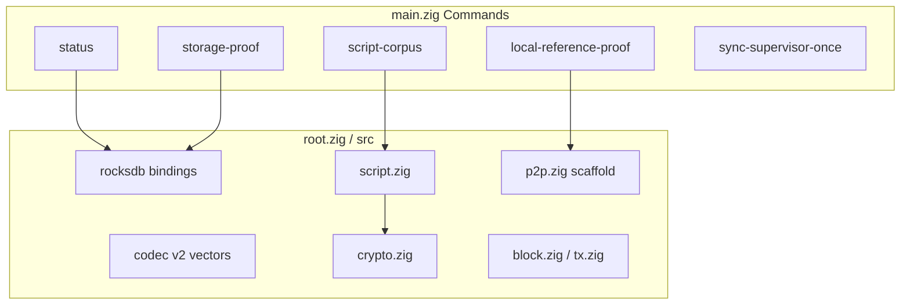

# zigbitnode Architecture

This document maps the Zig implementation: module roles, proof commands, and
the boundaries that will expand as live fetch/connect matures. For commands, use
[README.md](../README.md). For live mission-control posture, query Project
reports instead of reading this file as status.

Shared contracts own the cross-port rules:

- [Code documentation philosophy](../../Shared/CODE_DOCUMENTATION.md)
- [Validation pipeline](../../Shared/consensus/VALIDATION_PIPELINE.md)
- [Chainstate store](../../Shared/chainstate/CHAINSTATE_STORE.md)
- [Status contract](../../Shared/STATUS_CONTRACT.md)
- [Docker runtime contract](../../Shared/docker/DOCKER_RUNTIME_CONTRACT.md)
- [Consensus runway](../../Shared/consensus/CONSENSUS_RUNWAY.md)

## Implementation Scope

ZigNode exposes:

- RocksDB native storage smoke and status JSON
- Chainstate Codec v2 vector checks
- Native libsecp256k1 availability and vector checks
- Shared script corpus (`45/45`) through a Zig-native verifier
- Docker proof/supervisor command surfaces
- Contract-shaped local-reference proof scaffolding

Do not treat this structure map as a current gate claim. Project owns imported
benchmark, runway, and binary-gate posture.

## Module Layout



| Module | Responsibility |
|--------|----------------|
| `main.zig` | CLI dispatch, proof JSON emission, Docker/supervisor entrypoints. |
| `root.zig` | Port info, shared helpers exported to tests and commands. |
| `crypto.zig` | libsecp256k1 integration and native crypto reporting. |
| `script.zig` | Shared corpus verifier and script primitives. |
| `block.zig` / `tx.zig` | Block/transaction parsing helpers for future connect. |
| `p2p.zig` | Early P2P scaffolding for local-reference proof evolution. |

## Entrypoints

| Command | Role |
|---------|------|
| `status` | Read RocksDB/metadata posture from datadir. |
| `storage-proof` | Bounded storage gate evidence. |
| `codec-vectors` | Chainstate Codec v2 golden vectors. |
| `native-crypto-vectors` | Native crypto contract vectors. |
| `script-corpus` | Offline Shared 45-fixture harness. |
| `local-reference-proof` | Proof orchestrator toward local Reference P2P/RPC lanes. |
| `sync-supervisor-once` | Single supervisor tick for Docker operational loops. |

Proof commands write bounded JSON for Project import. They are evidence export,
not validation authority.

## Runtime Truth (Target Shape)

Native state lives under the selected datadir:

```text
<datadir>/
  .zigbitnode_native_storage
  chainstate-rocksdb/
  blocks/            # when block storage is wired end-to-end
  .zigbitnode.lock   # single-writer datadir lock (operational target)
```

When connect lands, the same invariants apply as other ports:

- block-local UTXO view before atomic chainstate commit
- validation blocker on missing rules
- runtime truth from RocksDB, not Project

## P2P And Connect (Planned Alignment)

Future Zig P2P should mirror workspace deferred advanced negotiation:

- simple `version` / `verack` / `sendheaders` during initial sync/comparator paths
- honest `start_height` from validated runtime truth
- no relay-oriented messages until runtime mode supports them honestly

Until then, treat `p2p.zig` as scaffold code behind proof commands, not production sync.

## Script Verification

`script.zig` clears the Shared corpus with `engine=zig_native` and
`crypto_backend=libsecp256k1`. Extend interpreter coverage here before claiming
live-chain connect beyond corpus proof.

Link script traps to
[`Docs/script-semantics-gotchas.md`](../../../Docs/script-semantics-gotchas.md).

## Docker And Proof

Follow `Nodes/Shared/docker/ports/zig.docker.json`. Docker proof volumes are
fresh comparability surfaces; do not confuse proof JSON with binary-gate status.

## Zig-Specific Design Choices

- **Comptime-friendly script module** — large opcode surface in one file today;
  split only when connect/P2P modules stabilize.
- **Explicit CLI in `main.zig`** — proof orchestration stays visible while the
  library surface is still growing.
- **Homebrew-native deps** — RocksDB and libsecp256k1 expected on dev hosts;
  Docker paths mirror other ports.

## Mission-Control Queries

```bash
python3 Project/scripts/report.py --db Project/project.db --section port-status
python3 Project/scripts/report.py --db Project/project.db --section consensus-runway
python3 Project/scripts/report.py --db Project/project.db --section baseline-5k
python3 Project/scripts/preflight_port_baseline.py --db Project/project.db --port zig --strict
python3 Project/scripts/preflight_consensus_runway.py --db Project/project.db --port zig --stage corpus --strict
```

When live connect ships, extend this document with P2P, connect, and lock sections
using [`port_architecture_outline.md`](../../Shared/code-documentation/port_architecture_outline.md).

## Reusable crypto boundary

The own_curve build imports a standalone package from Libraries. The package owns
public-input curve operations and contains no node imports. The port's crypto
adapter translates byte arguments and errors; script code owns sighashes,
signature suffixes and Taproot tagged hashing. The default C binding remains a
separate build, and Zig's existing standard-library curve is ecosystem_curve.

Candidate builds exclude alternate crypto implementations. Test-only probe builds
record actual adapter calls and can reject a selected primitive. These probes
never invoke a reference backend and are excluded from measured benchmarks.
Crypto provenance is persisted in node-owned metadata and exported through writer
progress; Project selects lane evidence independently of baseline readiness.
