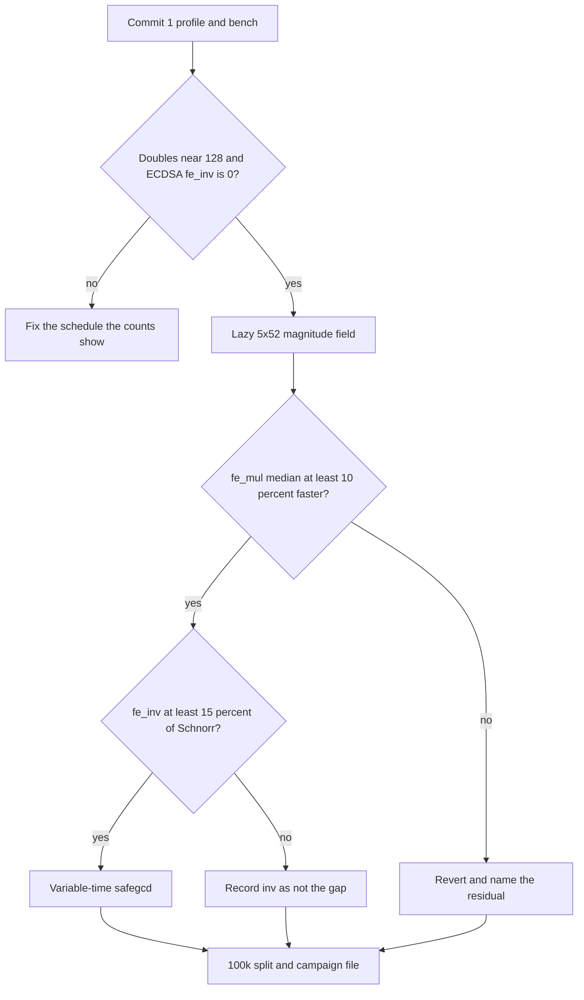

# Own-curve kernel campaign

Branch `zig/own-curve-kernel` from `main`. `zig/native-chainstate` is already an ancestor of `main` (no commits of its own). Do not branch from the current `zig/consensus-gaps` checkout, and do not carry its dirty evidence (`current_evidence.json`, the untracked mempool/mining result files).

## Where the 2× actually is

The measured gap is [zig_script_verify_split_host_2026-10-04.json](Nodes/Shared/conformance/results/zig_script_verify_split_host_2026-10-04.json): ECDSA 2.054–2.087×, Schnorr 2.012–2.099×, tweak 1.600–1.745×, flat across both 50k windows. That binary calls [Libraries/Zig/libsecp256k1-zig/src/root.zig](Libraries/Zig/libsecp256k1-zig/src/root.zig) through [Nodes/Zig/src/own_crypto.zig](Nodes/Zig/src/own_crypto.zig).

[Nodes/Zig/src/pure_secp.zig](Nodes/Zig/src/pure_secp.zig) is the ecosystem stdlib verifier. Own-curve builds replace it with `DisabledPure`. This campaign does not edit it. Retuning it would not move the split.

The kernel file is outside the node-only list in the brief. These are the files the work actually touches:

- [Libraries/Zig/libsecp256k1-zig/src/root.zig](Libraries/Zig/libsecp256k1-zig/src/root.zig) and [Libraries/Zig/libsecp256k1-zig/build.zig](Libraries/Zig/libsecp256k1-zig/build.zig) — arithmetic, counters, measurement exports
- [Nodes/Zig/src/crypto_bench.zig](Nodes/Zig/src/crypto_bench.zig) — new
- [Nodes/Zig/src/main.zig](Nodes/Zig/src/main.zig) — one `crypto-bench` command
- [Nodes/Zig/build.zig](Nodes/Zig/build.zig) — forward `-Dcurve-profile`; a bench binary that links the package and Homebrew libsecp256k1 together (normal own_curve builds stay unlinked)
- [Nodes/Zig/Makefile](Nodes/Zig/Makefile) — bench, profile, and campaign gate targets
- Evidence under [Nodes/Shared/conformance/results/](Nodes/Shared/conformance/results/) and the `own_curve_kernel` rows in [current_evidence.json](Nodes/Shared/conformance/current_evidence.json)
- Blockers, if any, appended to [Nodes/Zig/docs/blocker_ledger.jsonl](Nodes/Zig/docs/blocker_ledger.jsonl)

Left alone: [Nodes/Zig/src/root.zig](Nodes/Zig/src/root.zig), [mempool.zig](Nodes/Zig/src/mempool.zig), capture tooling, [script.zig](Nodes/Zig/src/script.zig), the C binding except as the bench’s comparison arm.

Commit 0 is this plan, committed as [Nodes/Zig/docs/own_curve_kernel_campaign.md](Nodes/Zig/docs/own_curve_kernel_campaign.md) before any code.

## What earlier campaigns already kept

`git log` on the kernel is two commits: `628b2c0` (clean-room package) and `548bf98` (common-Z and windows). Do not re-run these as if they were missing:

- Jacobian `a=0` doubling is already 2M+5S. Residual campaign kept it; relabeling it is not a speedup.
- GLV on both scalars. λ, β, and the lattice live as literals from `tools/derive_constants.py`. Residual ablations showed removing either split costs ~20%+.
- Signed windows, generator width 16 and variable width 4, one joint doubling chain (`joint`). Open campaign winner `shared-z-g16-p4` ([zig_open_20260916T084333Z.json](Nodes/Shared/conformance/crypto_comparisons/zig_open_20260916T084333Z.json)). Width neighbors and comb-4/6/8 were measured and not selected: a comb does not remove the variable point’s doublings.
- Generator tables `generator.bin` and `phi-generator.bin`, 2,097,152 bytes, produced by `tools/generate_tables.py`. No new comptime table. Existing bins stay build-step artifacts; this campaign does not comptime-compute a new one.
- Common-Z variable table instead of a per-entry inversion. Isolated ablation was inside noise. Keep it.
- Binary extended GCD. Batched 30-step divsteps were slower on verify and tweak. Do not repeat that batch.
- Canonical 4×64 limbs ([Project/scripts/zig_crypto_residual/field.zig](Project/scripts/zig_crypto_residual/field.zig)) lost. Checked and unchecked 5×52 that canonicalize every product failed the A0 primitive gate against the current `u256` multiply. A lazy 5×52 is a different experiment only because those kernels reduced to a canonical integer on every multiply.

libsecp256k1 0.8.0 is the linked C arm (`/opt/homebrew/Cellar/secp256k1/0.8.0`). Its README and `src/ecmult_impl.h` (v0.8.0) describe the verify recipe this package already follows: wNAF, Shamir joint multiplication, a large G window, GLV to 128-bit halves (`WNAF_BITS 128`), `WINDOW_A 5`, default `ECMULT_WINDOW_SIZE 15`, two G tables because of the endomorphism, Jacobian x-compare with no field inverse, and variable-time safegcd for inverses. Field arithmetic is 5×52 with a magnitude, not a canonical 256-bit integer. The 0.8.0 changelog’s force-inline is about an 11% C-side change, not this 2×.

## Counts, and the order they force

These are operation counts read off the current `joint` / `double` / `ecdsaXMatches` / `affine` path, not timings. Commit 1’s profile either confirms them or reorders the list before any shape is kept.

- `point_double`: about 128 per ECDSA and per Schnorr (bit length of the larger GLV half). The loop doubles once per bit, including leading zeros of the shorter stream only up to `max` length. Not ~256.
- `point_add`: one mixed add per nonzero digit. Width 16 is about 1/17 density on two G streams; width 4 is about 1/5 on two P streams. Order of ~70 mixed adds per verify, not one add per bit.
- `fe_mul`+`fe_sqr`: 2M+5S per double, plus about 8 multiplications per mixed add. About 1,500 field multiplications per ECDSA, before the square-root chain inside pubkey parsing (parsing sits inside verify).
- `fe_inv`: 0 on ECDSA (x is compared as `X ?== r·Z²`). 1 on Schnorr and on tweak, at the final affine. ECDSA has 1 scalar inverse.
- `to_affine`: 0 ECDSA, 1 Schnorr, 1 tweak.
- Table hits: equal to nonzero G-stream digits. The G table is already resident; a miss counter should stay near zero after the first call.

That mix cannot be a missing comb, a missing GLV split, or a missing joint chain. One field inverse, even at several times the C inverse, is a few percent of a verify that is 2× overall. ECDSA has no field inverse and is still 2.05×. Batch inversion has nowhere to attach on the verify path: the variable table is already common-Z, and there is at most one affine conversion.

Shape order:

1. Lazy 5×52 field with magnitude, carried through `double` and `mixed`, normalized only at equality tests, the Jacobian x-compare, affine output, and pubkey parse. This is the first speed commit. Target `fe_mul` and `fe_sqr`.
2. Variable-time safegcd only if the profile says `fe_inv` is at least ~15% of Schnorr or tweak time. It cannot close ECDSA. It is not the rejected batched divstep: early exit, from the Bernstein–Yang divstep as explained in libsecp’s `doc/safegcd_implementation.md`, with extra inverse vectors.
3. No width sweep, no comb, no second GLV. If the measured `point_double` count is near 256 or `fe_inv` on ECDSA is not 0, stop and fix that bug before anything else. That would mean this static reading was wrong.

Tweak is reported on every bench line and not given its own shape.

## Milestone 1 — instruments, no algorithm change

`crypto-bench` prints one JSON line, schema `port.own_curve.bench.v1`: CPU brand, `ReleaseSafe`, `source_commit`, `binary_sha256` of that bench binary, three repetitions, min and median ns/op. Judge on median. Same machine on every line that is compared.

Fixed inputs from the package vector file [native.json](Libraries/Zig/libsecp256k1-zig/src/testdata/native.json), iteration counts frozen in the schema (verify on the order of a few hundred, field ops a few thousand). Both backends for `ecdsa_verify`, `schnorr_verify`, `taproot_tweak_check`, and `pubkey_parse`. Own-curve only for `double_scalar_mul`, `scalar_mul_fixed`, `scalar_mul_var`, `point_add`, `point_double`, `to_affine`, `fe_mul`, `fe_sqr`, `fe_inv`, `fe_normalize`, `sc_mul`, `sc_inv`. The public C API does not expose the field and group ops; the line says so.

`-Dcurve-profile` is off in the timed binary. A second build increments `fe_inv`, `fe_mul`+`fe_sqr`, `point_double`, `point_add`, `to_affine`, and table hits inside the package, and `crypto-bench --profile` emits `port.own_curve.profile.v1` for the three verifies. Counters compile out when the flag is off.

Also in this commit, still with no hot-path change: a Zig test that derives λ and β as nontrivial cube roots, checks λ³ ≡ 1 (mod n), β³ ≡ 1 (mod p), and β·G = λ·G, and checks the stored lattice residuals stay inside the 2^129 bound. The stored integers may match the Python tool; the test is the proof. Generator-table entries stay checked against odd multiples the slow way, which the package tests already do.

Before the baseline numbers are written: `make test-crypto-vectors CRYPTO_BACKEND=own_curve` and `make test-crypto-mutations CRYPTO_BACKEND=own_curve`, plus `zig build test -Doptimize=ReleaseSafe` in the package. A red run is a bug.

Commit 1 message carries the baseline bench line and the profile counts. Those counts, if they disagree with the static reading above, replace the shape order in the campaign file before commit 2.

## Milestone 2 — one shape per commit

Each shape: vectors and mutations green, bench before and after, per-operation deltas in the commit message. Keep only if the targeted operation’s median improves by at least 10%. Otherwise revert and write the reason. If a kept shape moves `ecdsa_verify` or `schnorr_verify` by at least 10%, run the 50k gate before the next shape.

Lazy 5×52, implemented from the field description (five 52-bit limbs, 2^256 ≡ 2^32+977, magnitude bound so products do not overflow the limb type) and tested against the current `u256` field on the existing reduction and random-wide tests. No transcribed `field_impl.h` body, no copied reduction constants beyond that identity. Module header on `root.zig` states: verification is variable-time public data, same as the C verify path; this representation was learned from the libsecp256k1 0.8.0 README field section and the magnitude model in its field code, and was not translated from it. Lineage on the campaign file: `created: clean_room` at `628b2c0`, `optimized: reference_informed` at this commit.

Safegcd, if the profile qualifies it: same header treatment, citing Bernstein and Yang, “Fast constant-time GCD computation and modular inversion” (2019-04-13), and `doc/safegcd_implementation.md` for the divstep explanation. Variable-time early exit. Extra vectors for 0, 1, p−1, and random residues, compared with the binary GCD.

## Gates and evidence

50k is host, own_curve, native store, no shadow, fresh datadir `$(RB_STATE_ROOT)/zig/own-curve-kernel-50k` via a new Makefile target. Do not reuse `self-hosted-50k`. Oracle, from [zig_self_hosted_50k_host_2026-10-04.json](Nodes/Shared/conformance/results/zig_self_hosted_50k_host_2026-10-04.json): height 50000, hash `00000000e2c8c94ba126169a88997233f07a9769e2b009fb10cad0e893eff2cb`, UTXO count 568855, set hash `84f599c5259062428db7dc44de4444c7e918f4e4ae2b8bb2d3a3b8142e642231`. Record `timing_summary.stage_totals_ms.script_verify` (10206 ms on that artifact).

100k split when cumulative verify-median gain exceeds 25%, and once at the end even if it does not. Fresh datadir `own-curve-kernel-100k`. Compare per-kind ratios to the existing c_binding split artifact; do not rerun the C 100k. Oracle: height 100000, hash `0000000000524911745ab6eee9348bca9843c2c2b1b27eada246e3dc2f80b6b1`, UTXO count 13154991, set hash `8d9903614494e20141a3d93c7c23de26ee198d6b50c4f62287bc81613c66fc32`. Target: median microbench `ecdsa_verify` and `schnorr_verify` within 1.2× of the C arm, and every 10k window of the 100k split under 1.3×. Tweak is reported.

Capability-contract JSON for vectors, and for the three mutations, written under `Nodes/Shared/conformance/results/` after every kept shape. The mutation Makefile target today only asserts; extend it to emit `port.test_capability_contract.v1` the same way `test-crypto-vectors` does. Do not edit the emitter.

Final campaign file `zig_own_curve_kernel_campaign_host_<date>.json`, schema `port.own_curve.kernel_campaign.v1`: each shape’s before/after, kept or reverted with the reason, table bytes and the one-time load if any table becomes runtime-initialized, 50k `script_verify` after each qualifying shape, final 100k split, lineage, and the paper list (GLV 2001; Hankerson–Menezes–Vanstone; EFD Jacobian-0; Bernstein–Yang safegcd if used; libsecp256k1 0.8.0 README, `src/ecmult.h`, `src/ecmult_impl.h`, `doc/safegcd_implementation.md`). Bench and profile JSON, baseline and final, sit beside it.

Index under claim `own_curve_kernel`, provenance `run_ref` `zig-own-curve-kernel`. Import stored artifacts only. Lane rows may update. Port status does not move.

## If the target is missed

After the field shape and, at most, safegcd, stop. The campaign file’s residual is a sentence with a ratio: which counter is still slower than the C recipe’s documented counts (128-bit wNAF, window 15/5, 2M+5S, safegcd, 5×52 magnitude), and what fraction of verify that counter is. Not “further optimization possible.” A sixth shape runs only if that sentence names one, and the commit says it was unplanned. The likely named residual, if lazy 5×52 fails the 10% gate, is that a magnitude-tracked 5×52 still loses to LLVM’s widening `u256` multiply on this CPU, so the remaining gap is instruction schedule against the C 5×52, which this campaign measured and did not catch.
